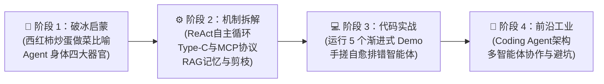

# 🤖 AI Agent 零基础通俗学习与实战库 (AiAgentLearn)

> 🎓 **专为零基础小白打造的前沿智能体学习与实战营**  
> 拒绝枯燥晦涩的学术黑话，用最接地气的生活比喻、掀开黑盒的数据包分析与极简纯粹的代码，带你从零理解底层机制，并亲手搓出一个属于你自己的 **Mini Pi Agent**！

---

## 🧭 四阶段极简学习通关图



---

## 📚 知识库与实战目录

### 📖 第一部分：通俗原理精讲 (`notes/`)

* **[🌟 学习路线总览与导航手册 (Roadmap)](notes/00-learning-roadmap.md)**
* **🐣 模块 1：建立直观认知（心智模型篇）**
  * [01. 什么是 AI Agent？（做菜比喻、大模型 vs 智能体、概念辟谣）](notes/01-concepts/01-what-is-agent.md)
  * [02. Agent 的四大核心部件（大脑、手脚、记事本、安全绳监工）](notes/01-concepts/02-four-components.md)
* **⚙️ 模块 2：搞懂核心运转机制（底层解密篇）**
  * [01. Agent 是怎么自主干活的？（想-做-看-纠错 ReAct 循环）](notes/02-mechanisms/01-agent-loop.md)
  * [02. 给 Agent 装上手脚（工具调用协议与 MCP 统一插口）](notes/02-mechanisms/02-tools-and-mcp.md)
  * [03. 给 Agent 装上记事本（短期记忆、开卷考 RAG 与会话树时光机）](notes/02-mechanisms/03-memory-and-rag.md)
  * [04. 怎样把信息喂给 Agent？（上下文工程、Prompt Caching 与 Token 剪枝）](notes/02-mechanisms/04-context-engineering.md)
* **🚀 模块 3：进阶场景与团队协作**
  * [01. 像程序员一样修 Bug 的 Coding Agent（自愈闭环揭秘）](notes/03-advanced/01-coding-agent.md)
  * [02. 多 Agent 团队分工协作（三大协作架构与过度设计避坑）](notes/03-advanced/02-multi-agent.md)
* **🔬 模块 4：Pi Agent 工业级源码剖析**
  * [01. Agent Loop 循环深度实现](notes/pi-agent/01-agent-loop.md)
  * [02. 生产级 Tool Calling 规范](notes/pi-agent/02-tool-calling.md)
  * [03. 会话树 Session Tree 数据结构](notes/pi-agent/03-session-tree.md)
  * [04. 工业级上下文剪枝策略](notes/pi-agent/04-context-pruning.md)
  * [05. Pi 配置与 18 个全局 Skills 速查手册](notes/pi-agent/05-pi-config-skills.md)

---

### 💻 第二部分：手搓 Mini Pi Agent 代码实战 (`projects/mini-pi-agent/`)

> 💡 **小白零门槛保证**：所有 Demo 内置智能模拟模式，**不需要配置任何 API Key，开箱直接 100% 跑通！**

* **🛠 [Mini Pi Agent 实战项目入口](projects/mini-pi-agent)**
  * **Demo 1**: [最简 Agent Loop 循环](projects/mini-pi-agent/src/demo1-minimal-loop/index.ts) —— 30 行代码看懂 Think-Act-Observe 闭环
  * **Demo 2**: [Core Four 真实核心工具](projects/mini-pi-agent/src/demo2-tools/index.ts) —— 本地真实读写改跑（read, write, edit, bash）
  * **Demo 3**: [Session Tree 状态回溯](projects/mini-pi-agent/src/demo3-session-tree/index.ts) —— 允许 Agent 做错事一键后悔的时光机
  * **Demo 4**: [Token 剪枝与上下文压缩](projects/mini-pi-agent/src/demo4-compression/index.ts) —— 掐头去尾保留核心报错，防爆上下文
  * 🌟 **Demo 5 (大结局)**: **[完整手搓 Mini Pi Agent CLI](projects/mini-pi-agent/src/demo5-mini-pi-cli/index.ts)** —— 四大器官终极合体，实弹演练写代码、跑测试、捕获报错、局部修代码到全绿通过自愈！

---

## 🚀 极速上手跑代码

```bash
# 1. 进入实战代码目录
cd projects/mini-pi-agent

# 2. 安装依赖（仅需一次）
npm install

# 3. 运行任意想要体验的 Demo
npm run demo1   # 体验最简循环
npm run demo2   # 体验四大核心工具
npm run demo3   # 体验会话树分支回退
npm run demo4   # 体验上下文剪枝
npm run demo5   # 🌟 体验完整端到端自愈智能体！
```
