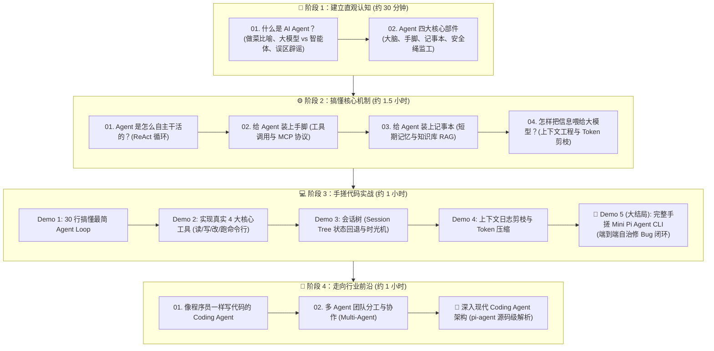

# 🗺️ AI Agent 零基础通关学习路线图 (Roadmap)

> 💡 **给小白的学习寄语**：  
> 学习 AI Agent 不需要先学微积分，也不需要精通机器学习算法。  
> **Agent 的本质不是“算法魔法”，而是一套聪明的“软件工程架构设计”**——学会怎么给聪明的大脑（大模型）配上手脚、记事本和监工，让它替你跑腿干活！

---

## 🧭 四大阶段通关总览

---

## 📚 详细学习目录与通关清单

### 🐣 阶段 1：建立直观认知（心智模型篇）
*目标：打破对大模型的刻板印象，搞懂 Agent 的定义与身体结构。*
- [x] [01. 什么是 AI Agent？](01-concepts/01-what-is-agent.md)
  - 🍳 生活例子：做西红柿炒鸡蛋，看懂军师 vs 跑腿实习生
  - 🆚 深度对比：普通 LLM、工作流（Workflow）、自动化脚本与 Agent 的区别
  - ❌ 小白常见误区辟谣：Prompt 提示词写得好就是 Agent 吗？
- [x] [02. Agent 的四大核心部件](01-concepts/02-four-components.md)
  - 🧩 人体解剖学结构：大脑（LLM）、手脚（Tools）、记事本（Memory）、监工安全绳（Harness）
  - 💥 反面推演：如果 Agent 缺了其中任何一个部件会闹出什么笑话？

---

### ⚙️ 阶段 2：搞懂核心机制（底层解密篇）
*目标：透过黑盒看本质，看清通信协议、数据包长什么样。*
- [x] [01. Agent 是怎么自主干活的？(Agent Loop)](02-mechanisms/01-agent-loop.md)
  - 🔄 ReAct 范式：想 (Think) $\to$ 做 (Act) $\to$ 看 (Observation) $\to$ 纠错
  - 📦 真实数据包长啥样：大模型与运行时的 JSON 通信揭秘
  - 🛑 终止机制与死循环防护：怎样防止 Agent 像无头苍蝇一样疯狂刷钱？
- [x] [02. 给 Agent 装上手脚 (工具调用与 MCP)](02-mechanisms/02-tools-and-mcp.md)
  - 🔌 为什么大模型能操作真实电脑？Tool Calling 的 JSON Schema 协议
  - 🌐 爆火的 **MCP (Model Context Protocol)** 是什么？Type-C 统一插口的比喻
  - 🛠️ 软件工程领域最关键的“四大金刚”工具 (`read`, `write`, `edit`, `bash`)
- [x] [03. 给 Agent 装上记事本 (记忆与 RAG)](02-mechanisms/03-memory-and-rag.md)
  - 📝 短期便签记忆 vs 🗄️ 长期知识库记忆
  - 📖 为什么说 RAG 是“开卷考试”？
  - 🌲 会话树（Session Tree）：允许 Agent 后悔与重构的“时光机”
- [x] [04. 怎样把信息喂给 Agent？(上下文工程)](02-mechanisms/04-context-engineering.md)
  - 🪑 桌面整理法则：System Prompt、工具定义、历史摘要的最佳排布
  - 🕳️ “迷失在中间 (Lost in the Middle)”与现代 **Prompt Caching** 缓存加速原理
  - ✂️ Token 剪枝实战：怎样让几万行的终端报错不把大模型撑爆？

---

### 💻 阶段 3：手搓代码实战（跑通 Mini Pi Agent）
*目标：拒绝纸上谈兵，在本地运行代码，看 Agent 是如何跑起来的。*
*项目路径：[`projects/mini-pi-agent`](file:///d:/code/sanbox/AiAgentLearn/projects/mini-pi-agent)*

| 实战项目 | 核心看点 | 运行命令 |
| :--- | :--- | :--- |
| **Demo 1** | [最简 Agent Loop 循环](file:///d:/code/sanbox/AiAgentLearn/projects/mini-pi-agent/src/demo1-minimal-loop/index.ts) | `npm run demo1` |
| **Demo 2** | [Core Four Tools 真实动效](file:///d:/code/sanbox/AiAgentLearn/projects/mini-pi-agent/src/demo2-tools/index.ts) | `npm run demo2` |
| **Demo 3** | [Session Tree 状态回溯与分支](file:///d:/code/sanbox/AiAgentLearn/projects/mini-pi-agent/src/demo3-session-tree/index.ts) | `npm run demo3` |
| **Demo 4** | [Token 剪枝与上下文压缩策略](file:///d:/code/sanbox/AiAgentLearn/projects/mini-pi-agent/src/demo4-compression/index.ts) | `npm run demo4` |
| 🌟 **Demo 5** | **[完整端到端手搓 Mini Pi Agent CLI](file:///d:/code/sanbox/AiAgentLearn/projects/mini-pi-agent/src/demo5-mini-pi-cli/index.ts)** | `npm run demo5` |

> 💡 **小白零门槛保证**：Demo 5 采用智能**双模架构**，哪怕你没有大模型 API Key，也能开箱运行完整的“自主创建代码 $\to$ 跑测试报错 $\to$ 自主定位分析 $\to$ 局部修代码 $\to$ 再次测试全绿自愈”完整闭环！

---

### 🚀 阶段 4：走向行业前沿（高阶场景与工程剖析）
*目标：了解当前最火热的工业级 Coding Agent 与多智能体架构。*
- [x] [01. 像程序员一样修 Bug 的 Coding Agent](03-advanced/01-coding-agent.md)
  - 真实 Coding Agent 的排错闭环：查找、阅读、局部精确替换、跑测试自愈
  - 为什么它不会像新手那样粗暴重写整个文件？
- [x] [02. 多 Agent 团队分工协作 (Multi-Agent)](03-advanced/02-multi-agent.md)
  - 架构模式：主管-员工制、流水线接力制、对抗辩论制
  - 避坑指南：什么时候该用 Multi-Agent，什么时候单 Agent 就够了？
- [x] **[🔬 Pi Agent 工业级架构剖析](pi-agent/01-agent-loop.md)**
  - [01. Agent Loop 循环工程实现](pi-agent/01-agent-loop.md)
  - [02. 生产级 Tool Calling 规范](pi-agent/02-tool-calling.md)
  - [03. 会话树 Session Tree 深度设计](pi-agent/03-session-tree.md)
  - [04. 工业级上下文剪枝策略](pi-agent/04-context-pruning.md)
  - [05. Pi 配置与 18 个全局 Skills 速查手册](pi-agent/05-pi-config-skills.md)
