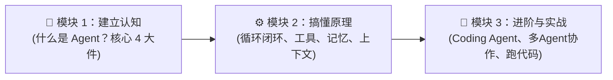

# 🗺️ AI Agent 零基础学习路线图 (Roadmap)

> **欢迎来到 AI Agent 学习世界！**  
> 无论你是编程小白还是刚接触大模型的开发者，这里为你整理了**最清晰、最接地气、拒绝空话**的学习路线。

---

## 🧭 学习路线总览

---

## 📚 目录导航

### 🐣 模块 1：建立直观认知 (01-concepts)
- [01. 什么是 AI Agent？](01-concepts/01-what-is-agent.md) —— 从“做番茄炒蛋”生活例子看懂它与普通 ChatGPT 的区别。
- [02. Agent 的四大核心部件](01-concepts/02-four-components.md) —— 大脑（LLM）、手脚（Tools）、记事本（Memory）、监工安全绳（Harness）。

### ⚙️ 模块 2：搞懂核心运转机制 (02-mechanisms)
- [01. Agent 是怎么自主干活的？(Agent Loop)](02-mechanisms/01-agent-loop.md) —— “想 $\to$ 做 $\to$ 看 $\to$ 纠错”的闭环魔法。
- [02. 给 Agent 装上手脚 (Tools 与 MCP)](02-mechanisms/02-tools-and-mcp.md) —— 如何让只会动嘴的模型能够去点鼠标、查网页、改文件。
- [03. 给 Agent 装上记事本 (记忆与 RAG)](02-mechanisms/03-memory-and-rag.md) —— 短期便签不遗忘，长期知识库随用随查。
- [04. 怎样把信息喂给 Agent？(上下文工程)](02-mechanisms/04-context-engineering.md) —— 为什么信息放的位置不对，大模型就会变笨。

### 🚀 模块 3：进阶认知与代码实战 (03-advanced & projects)
- [01. 像程序员一样修 Bug 的 Coding Agent](03-advanced/01-coding-agent.md) —— 它如何自己读项目、写代码、跑测试自愈。
- [02. 多 Agent 团队分工协作 (Multi-Agent)](03-advanced/02-multi-agent.md) —— 几个 Agent 如何组建一个小团队共同搞定大项目。
- 💻 **上手跑跑代码（Mini Pi Agent）**：
  - [Demo 1: 最简循环代码](file:///d:/code/sanbox/AiAgentLearn/projects/mini-pi-agent/src/demo1-minimal-loop/index.ts)
  - [Demo 2: 装上四大核心工具](file:///d:/code/sanbox/AiAgentLearn/projects/mini-pi-agent/src/demo2-tools/index.ts)
  - [Demo 3: 状态回退与会话树](file:///d:/code/sanbox/AiAgentLearn/projects/mini-pi-agent/src/demo3-session-tree/index.ts)
  - [Demo 4: 上下文压缩保活](file:///d:/code/sanbox/AiAgentLearn/projects/mini-pi-agent/src/demo4-compression/index.ts)
