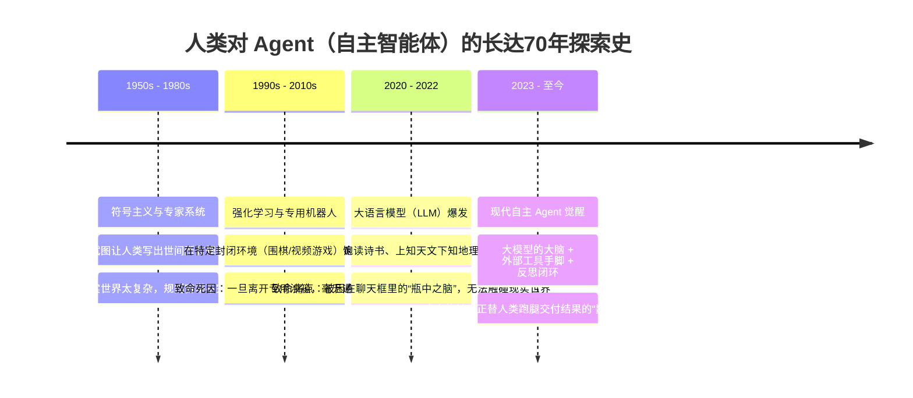
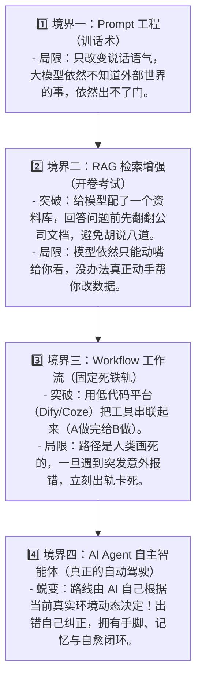

# 01. 什么是 AI Agent？——从“瓶中之脑”到“数字打工人”的前世今生

> **导读**：  
> 为什么在 ChatGPT 已经能写诗、能考过法考的今天，全世界的技术巨头和顶级极客却一致断言：**“真正的未来不是大模型（LLM），而是基于大模型的 AI Agent”**？  
> 人类为了让机器“自主干活”，在过去 70 年里经历了怎样波澜壮阔的探索与惨痛失败？  
> 本篇将带你从历史源头出发，理清 AI Agent 的前世今生，用环环相扣的逻辑撕开所有行业黑话，彻底建立清晰的心智模型。

---

## 一、 溯源：人类对“智能体 (Agent)”长达 70 年的执念

要真正理解 Agent，我们必须先回到词源。  
在计算机科学和哲学中，“**Agent（智能体 / 代理）**” 这个词源于拉丁语动词 *agere*，意思是**“行动、去驱动、产生影响”**。

在长达大半个世纪的人工智能发展史中，人类尝试过三波让机器“自主行动”的探索，但每一次都撞上了无法逾越的高墙：

### 1. 第一代探索（1950s - 1980s）：符号主义专家系统的“规则泥潭”
- **人类的想法**：既然人是通过逻辑做事的，那只要程序员把全世界所有的“如果...就...（if-then）”规则全部写进电脑，机器不就能自主办事了吗？
- **为什么撞墙？**  
  现实世界的混乱程度远超想象。比如教一个机器人“怎么过马路”，人类写了“红灯停绿灯行”，但现实中可能遇到：救护车按喇叭闯红灯、交警现场手势指挥、路面施工绕行……**人类根本不可能穷举出世间所有的常识和规则**。最终，专家系统沦为了僵硬脆弱的死代码。

### 2. 第二代探索（1990s - 2010s）：强化学习的“封闭温室”
- **人类的想法**：不写死规则了，让 AI 自己去虚拟环境里试错（强化学习，如 AlphaGo、OpenAI Five 游戏战队）。赢了给胡萝卜（奖励分），输了给大棒。
- **为什么撞墙？**  
  围棋和电竞拥有极其严格、封闭的数学规则和明确的输赢分数。但现实办公、写代码、发邮件等人类事务，**根本没有现成的数学公式来计算“奖励函数”**。离开封闭温室，强化学习立刻失去了方向。

### 3. 拐点来临（2020 - 2022）：横空出世的“瓶中之脑”
直到 Transformer 架构与海量互联网数据训练出了 ChatGPT（GPT-3.5/GPT-4），人类历史上第一次拥有了**具备海量通识、能听懂任何人类黑话的大脑**！

但是，兴奋的人类很快发现了一个极度尴尬的现实：  
**这个大模型的大脑，就像被泡在玻璃瓶里的一团纯意识（Brain in a Vat）。**
- 你问它：“我想去杭州西湖玩，帮我做个攻略”，它能在 3 秒内吐出 2000 字辞藻华丽的行程；
- 但你接着说：“太棒了，帮我把刚才这趟 10 点的高铁票买了吧，再把酒店定了”，它只能冷冰冰地回复：“抱歉，我只是一个语言模型，无法为您执行购票操作，请您自行前往 12306 购买。”

**大模型拥有世界上最博学的大脑，却长着一副“高位截瘫”的身躯——它没有手脚，碰不到操作系统，更连不上一根真实的网线。**  
为了给这个“瓶中之脑”装上手脚和神经系统，**AI Agent（现代智能体）** 应运而生！

---

## 二、 试炼：2023 年那场席卷全球的 AutoGPT 狂热与惨烈崩盘

你如果想真正看懂 Agent 的设计精髓，就必须了解 2023 年初震撼整个硅谷的 **AutoGPT 事件**。这是每个学习 Agent 的人绕不开的经典教材。

### 1. 狂热的诞生：只需一句话，AI 自己干活？
2023 年 3 月底，一个名为 **AutoGPT** 的开源项目在 GitHub 上线，短短几天狂揽十几万颗 Star，创下开源历史记录。  
它的口号极其诱人：  
> *“你只要在终端输入一句话：‘帮我调研一下今年最赚钱的 5 个电商细分赛道，写一份调研报告存成 PDF’，然后你就可以去睡觉了，AutoGPT 会自己上网搜资料、自己分析、自己写文件！”*

### 2. 惨痛的翻车：几百美元一夜烧光，只留下一堆死循环垃圾
然而，当成千上万的极客兴冲冲地掏出信用卡、填入 OpenAI API Key 运行它时，灾难发生了：
- **场景一：无尽的鬼打墙（死循环）**  
  AutoGPT 想要搜索网页，遇到了一个网站的验证码；它不知道怎么处理，于是大模型反思：“我再搜一次试试” $\to$ 再次被拦截 $\to$ “我换个关键词搜” $\to$ 再次被拦截……整整重试了 300 轮，一晚上烧光了用户 50 美元的 Token，最终生成了一份只有标题的空白文档。
- **场景二：目标漂移与遗忘（注意力涣散）**  
  本来是让它搜电商赛道，搜着搜着搜到了一篇关于“亚马逊物流纸箱尺寸”的网页，AutoGPT 竟然跑去深入研究纸箱瓦楞纸厚度了，彻底忘了主人最初给的目标！
- **场景三：不可控的破坏（缺少安全防护）**  
  有用户的本地测试文件被它误删，甚至有 Agent 在死循环中疯狂发送上百封重复邮件。

### 3. 这场惨痛教训留给人类的启示
AutoGPT 的“夭折”并没有杀死 Agent，反而**逼迫全世界最顶尖的工程师开始严肃思考**：  
要让一个博学的大模型真正变成可靠的 Agent，绝不是“写一个死循环不断 call 模型”那么轻率。  
我们必须为它建立：
1. **严格的认知闭环（为什么它会走入死胡同？）**
2. **安全可控的工具定义（怎么让它精准操作现实且不破坏系统？）**
3. **结构化的记忆与时光机机制（做错事怎么回退？）**
4. **上下文治理与监工（怎么防止它注意力走神与烧光 Token？）**

---

## 三、 什么是现代 AI Agent？撕开黑话看本质

有了前世今生的铺垫，我们现在可以给 AI Agent 一个最精确、最通俗的定义：

> **现代 AI Agent = 一个以大语言模型（LLM）为决策核心，能够自主感知环境、规划行动、调用外部工具、并根据执行反馈不断自我纠错，直至完成最终目标的自主闭环系统。**

### 深度辨析：普通大模型 vs AI Agent

为了让你彻底看清两者的物理分界线，请看下面的行为对照表：

| 核心维度 | 普通大模型 (LLM / 如 ChatGPT 网页版) | 现代 AI Agent (智能体 / 如 Cursor, Devin, Pi) |
| :--- | :--- | :--- |
| **存在形态** | 纯文本概率预测器（输入一段文字 $\to$ 预测下一个词） | 具备感知、行动与持久记忆的**自主软件系统** |
| **工作模式** | **单向被动响应**（人类推一下，它动一下） | **自主循环自运转**（人类给一个目标，它自己循环直到搞定） |
| **与现实的连接** | **隔离**（碰不到你的硬盘，发不出网络请求） | **连接**（能调终端 bash、读写硬盘、查数据库、发 API） |
| **遇到错误时** | 毫无知觉；如果生成的代码有 Bug，除非人类提醒，否则它不知道 | **实弹运行并自愈**：自己跑测试，看到红字报错自己读，自己改代码重跑 |
| **思维范围** | 活在一次对话的几千个 Token 里，关掉窗口全忘光 | 拥有任务状态树（Session Tree）、向量库记忆，做错可回退时光机 |

---

## 四、 知识点大串联：AI 应用的“四重境界”

很多小白在学习时，常常分不清这些词：**Prompt 工程、RAG、工作流 (Workflow)、Agent**。  
它们到底是什么关系？它们是人类一步步解决“瓶中之脑”缺陷的阶梯式产物：

1. **Prompt 技巧**：就像给一个天才员工开会训话，教他“怎么回答更有条理”，但他依然坐在工位上哪儿也去不了；
2. **RAG 知识库**：就像给这个员工搬来了一整座企业内部档案柜，他答题前可以翻书照着念，但他依然没有手脚；
3. **Workflow 工作流**：就像给员工规定了死板的流水线 SOP（第一步打开文件 $\to$ 第二步提取名字），一旦某一天客户传来的文件改成了英文格式，流水线就直接崩溃；
4. **AI Agent**：这才是真正的**全自主合伙人**。遇到意外情况，它会停下来思考：“咦，这个接口变了，让我用搜索工具查一下官方最新文档，换个新参数再试试”，这就是自适应智能！

---

## 五、 承前启后：要让 Agent 真正落地，必须攻克哪四座大山？

通过上一节 AutoGPT 的翻车教训，你已经明白：**光有一个会调用循环的 Prompt，Agent 必然会崩溃。**

一个在生产环境中能连续跑几小时、修成百上千行代码的工业级 Agent，内部必须精妙地解决这 4 个工程难题：
1. **怎么让它像人类一样步步推理且不出轨？** ➡️ 对应 [01. Agent 运行循环 (Agent Loop)](../02-mechanisms/01-agent-loop.md)
2. **怎么给它设计安全、标准、不烧钱的插座和手脚？** ➡️ 对应 [02. 工具调用与 MCP 协议](../02-mechanisms/02-tools-and-mcp.md)
3. **怎么让它拥有时光机，走错路能一键回退？** ➡️ 对应 [03. 记忆系统与知识库 RAG](../02-mechanisms/03-memory-and-rag.md)
4. **怎么在面对几万行报错时不被撑爆 Token、不走神？** ➡️ 对应 [04. 上下文工程与 Token 剪枝](../02-mechanisms/04-context-engineering.md)

在深入这四大底层机制之前，下一节我们将用解剖学的方式，给 Agent 的“肉身”做一个最直观的体检——  
👉 **[02. Agent 的四大核心部件（大脑、手脚、记事本、监工）](02-four-components.md)**
