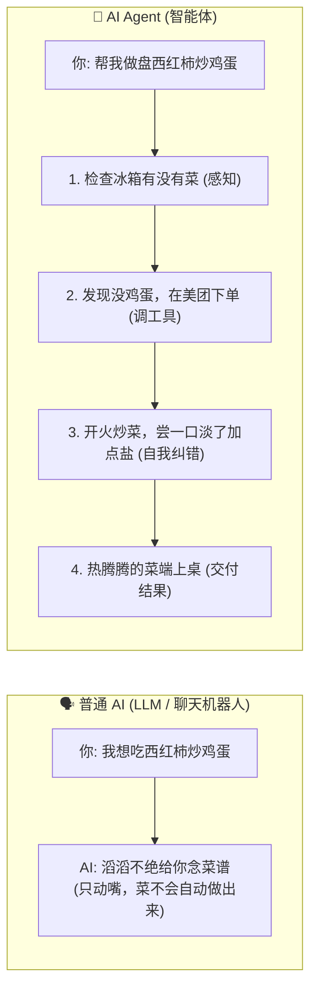

# 01. 什么是 AI Agent？（通俗入门篇）

> **一句话大白话**：  
> 普通大模型（如 ChatGPT）是**“只动嘴的军师”**；  
> 而 **AI Agent（智能体）** 是**“真正帮你把活干完的超级实习生”**。

---

## 🍳 一个生活中的例子，秒懂区别

想象一下你肚子饿了，想吃“西红柿炒鸡蛋”：

### 为什么会有这种差距？
- **普通大模型**：无论它看了多少书，它都**只能输出文字**。你问一句，它答一句。
- **AI Agent**：你给它一个最终目标，它会**自己拆解步骤、自己去调各种软件/工具、出错自己重试，直到把最终结果交付给你**。

---

## 🆚 深度对比表格

| 维度 | 普通大模型 (LLM) | AI Agent (智能体) |
| :--- | :--- | :--- |
| **形象比喻** | 房间里的百晓生（能说会道，但出不了门） | 能跑腿的全能管家（有脑子、有手脚、能出门） |
| **与世界的交互** | 只能接收文字，输出文字 | 可以点鼠标、查网页、改电脑文件、调外部 API |
| **工作方式** | 单轮/多轮问答（输入 $\to$ 输出） | **自主循环**（目标 $\to$ 规划 $\to$ 执行 $\to$ 纠错 $\to$ 完成） |
| **遇到错误时** | 往往直接停止，等人类提醒才改 | 自己看报错日志，自己反思并自动换方法重试 |

---

## 💡 总结

学习 AI Agent，你不是在研究怎么写出更优美的提示词，而是学习**怎么给大模型装上手脚、记事本和工作流程，让它变成一个能独立办事的数字员工**！
