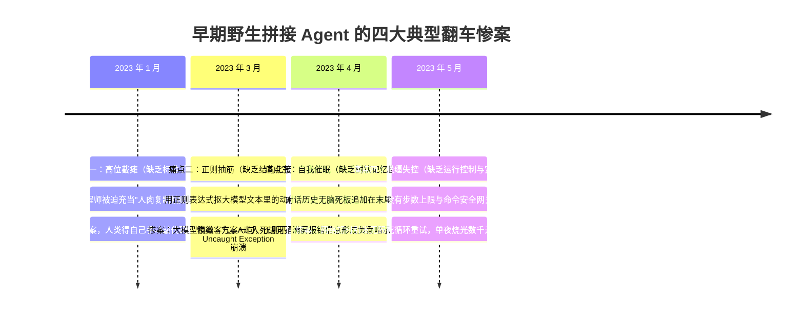
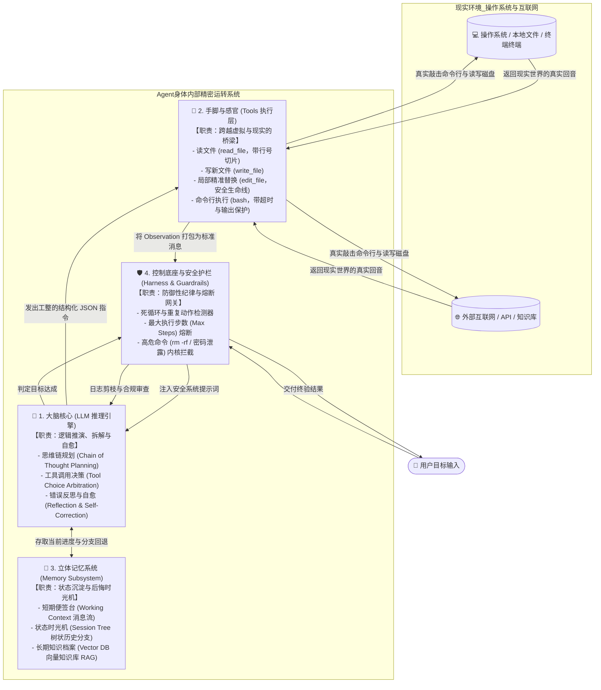

# 02. Agent 的四大核心部件——解剖一只能够独立上岗的“数字员工”

> **承接上篇**：  
> 在上一篇中，我们穿越了人类对 Agent 长达 70 年的执念，复盘了 2023 年 AutoGPT 死循环烧穿钱包的历史惨案。  
> 为什么把一个聪明的千亿参数大模型（LLM）放进一个死循环代码里，不仅成不了能干的智能体，反而会沦为破坏力惊人的“数字推土机”？  
> 人类工程师在工位上写代码、修系统时，身体和大脑究竟协同调用了哪些不可或缺的系统？  
> 本篇我们将采用现代系统工程与解剖学视角，彻底拆解商业级 AI Agent 的 **4 大核心器官**——看清它们是如何从早期原始混乱的“野生脚本”，进化为今天精密咬合的工业级架构的。

---

## 一、 溯源：单体大模型的生理残疾与早期的“弗兰肯斯坦怪兽”

在 2023 年初，当全世界工程师意识到 ChatGPT 只是一个“被困在聊天框里的瓶中脑”时，大家的第一反应极其原始粗暴——**用最土的胶水代码，把大模型和外部程序强行缝合在一起**。

这一时期诞生了大量像“科学怪人弗兰肯斯坦”一样畸形的早期 Agent，并在生产环境中引发了接二连三的荒诞惨案：

### 🔬 还原四大真实微观惨案：为什么野生拼凑必死无疑？

#### 🩸 惨案一：高位截瘫（缺乏手脚）—— 2023 年 1 月的“人肉机械臂”
在 ChatGPT 刚横空出世时，开发者以为自己马上要被 AI 取代了，纷纷用它写代码。但现实工作流程很快演变成了一场滑稽的“手部运动”：
- **现场还原**：
  1. 人类在网页端输入：“帮我用 Python 写一个抓取知乎热榜存入 CSV 的脚本”；
  2. 大模型在 3 秒内吐出了 60 行漂亮的代码；
  3. 人类滑动鼠标按 `Ctrl+C` 复制代码 $\to$ 切换到 VS Code 新建 `zhihu.py` 按 `Ctrl+V` 粘贴；
  4. 打开终端敲 `python zhihu.py`，终端红字报错：`ModuleNotFoundError: No module named 'requests'`；
  5. 人类把报错复制下来，切回浏览器贴给 ChatGPT：“报了这个错怎么办？”；
  6. 模型：“抱歉主人，您需要先运行 `pip install requests`” $\to$ 人类再切回终端敲安装命令……
- **本质死因**：大模型拥有千亿参数的大脑，却生活在**与世隔绝的真空聊天框**里。它没有眼睛看你的桌面，没有手去建文件，更碰不到终端。**人类工程师本想靠 AI 摸鱼，结果一天下来手腕得了腱鞘炎，人类沦为了大模型和操作系统之间最卑微的“人肉机械臂”！**
- **逼出的进化**：必须把本地操作系统的文件读写与终端命令直接开放给大模型，让它自己建文件、自己敲命令 —— 这就是 **手脚 (Tools 工具箱)** 的起源。

---

#### 🩸 惨案二：正则抽筋（缺乏结构化协议）—— 2023 年 3 月的“脆弱正则地狱”
为了不当人肉机械臂，早期的极客们（包括初代 LangChain 和 AutoGPT）开始用代码来自动解析模型的动作。  
但当时 OpenAI 的 API 根本没有现在的 `tools` 或 `function_calling` 接口，**大模型只能输出纯自然语言文字**。程序员们便在 Prompt 里写下血书：
> *“你是一个自动化助手。如果你想执行命令，必须严格输出格式：`Action: run_bash[你的命令]`，严禁输出任何多余废话！”*

后端 Python 代码用正则表达式苦苦抠取：`match = re.search(r'Action:\s*run_bash\[(.*?)\]', model_output)`。
- **惨绝人寰的翻车现场**：
  - **礼貌过头崩溃**：大模型客气了一句：“好的主人，我为您执行：Action: run_bash[ls -la]” ➡️ 正则头部没对齐，匹配失败，Python 抛出 `AttributeError: 'NoneType' object has no attribute 'group'` 当场挂死！
  - **中括号嵌套崩溃**：大模型想提交 Git：`Action: run_bash[git commit -m "[fix] 修复登录Bug"]` ➡️ 贪婪正则遇到内部中括号导致截断错误，在终端执行了一条残废命令 `git commit -m "[fix`，直接引发终端死锁！
  - **格式微变崩溃**：模型偶尔加了个空格或换行，正则匹配全军覆没。
- **本质死因**：**用自然语言充当系统调用协议，是软件工程史上的巨大倒退。**
- **逼出的进化**：迫使 OpenAI 于 2023 年 6 月正式发布 **Function Calling 规范**——直接在模型预训练层强化结构化遵循能力，让大模型在调用工具时 100% 吐出标准的 **JSON Schema 数据包**，工具调用才告别了“抽筋骨折史”。

---

#### 🩸 惨案三：自我催眠（缺乏树状记忆回溯）—— 2023 年 4 月的“错误迷雾深渊”
当工具能调通后，工程师尝试让 Agent 处理复杂的多步骤任务，比如：“帮我把项目从 CommonJS 改成 ES Module”。  
当时大家保存历史记录的方式极其原始——**用一个简单的扁平数组（Array），无脑把每轮消息往后追加**。
- **现场还原**：
  - 第 1 轮：Agent 尝试方案 A（在 package.json 加 `"type": "module"`），跑测试报错 `ERR_REQUIRE_ESM`；
  - 第 2 轮：Agent 看到报错，尝试引入外部垫片库，结果引发全局依赖冲突，终端喷出 200 行 C++ 编译异常；
  - 到了第 5 轮：上下文里堆积了 3 轮失败尝试的代码和整整 400 行编译红字堆栈！
  - 第 6 轮：**大模型彻底失心疯！** 它的注意力机制被这堆长篇累牍的错误日志彻底“催眠”，误以为当前主要矛盾是去修 node-gyp 底层编译，开始去修改注册表、尝试重装系统，彻底把最初“改语法”的目标忘得一干二净！
- **本质死因**：人类工程师走入死胡同时，本能动作是按 `Ctrl+Z` 或 `git checkout .`（一键回退到干净起点换方案 B）。而扁平数组的 Agent 只能一条道走到黑，试错失败的脏代码与海量报错堆满了整个上下文，导致严重的**上下文污染（Context Contamination）与负面错误暗示**。
- **逼出的进化**：记忆绝不能是一个单向扁平列表，必须是一棵支持状态回退与分支探索的 **会话树 (Session Tree)**！路线 A 走不通，一键 Checkout 回退到分叉点，把失败记录彻底剥离。

---

#### 🩸 惨案四：脱缰失控（缺乏运行控制与安全护栏）—— 2023 年 5 月的“信用卡火灾与删库”
AutoGPT 火爆全球后，大量开发者幻想着“晚上启动 Agent，早上醒来产品做好了”。然而，真实世界等来的却是灾难：
- **价值 800 美元的“晚安死循环”**：  
  某海外极客让 Agent 监控竞品推文，凌晨 2 点 Twitter API 触发限流返回 `429 Rate limit exceeded`。因为代码里只写了一个粗暴的 `while(true)`，没有最大步数限制。大模型反思：“接口失败了，我 1 秒后再试一次”，整整 5 小时高频自问自答狂调 GPT-4，**一觉醒来报告没写出来，信用卡收到了 800 多美元（约合 6,000 元人民币）的巨额账单！**
- **毫无敬畏的自愈删库**：  
  某开发者让 Agent 清理旧日志文件。Agent 在计算路径变量时因环境混淆计算出了空字符串，随后在没有权限网关的环境下盲目执行了 `rm -rf /`，数十毫秒内把本地代码库和测试数据库清了个一干二净！
- **本质死因**：大模型只是一个数学概率机，它**既没有对金钱成本的概念，也没有对数据毁灭的恐惧**。
- **逼出的进化**：确立了工业级 Agent 的底层兜底中枢——**运行控制框架与安全护栏 (Harness & Guardrails)**：硬性最大步数熔断（Max Steps Limit）、Token 预算预警与高危指令沙箱拦截。

---

### 💡 结论：四大器官，缺一不可

人类工程师在做事时，**从来不是只靠一个裸脑在运转**：
1. **脑子 (LLM)** 负责推演意图和拆解目标；
2. **手脚 (Tools)** 负责敲键盘、看屏幕、拿反馈；
3. **记事本 (Memory)** 负责记录进度，走错路时翻页回退；
4. **安全底线与控制框架 (Harness & Guardrails)** 负责严格把关：防死循环、防破产、防破坏。

**如果缺少了任何一个环节，大模型就只是一团不可控的混沌概率云。**  
正是这四桩惨烈翻车，逼迫软件工程界确立了今天的**标准四大器官架构（The Four Pillars of Agent Architecture）**。

---

## 二、 破局：四大核心器官的解剖学全景

---

## 三、 四大器官技术硬核深度拆解

### 🧠 1. 大脑 (LLM 推理核心)：从“单轮生成”到“自主规划与反思”
- **现实映射**：DeepSeek-V3/R1、Claude 3.5 Sonnet、GPT-4o。
- **它在 Agent 里的本质演变**：  
  在传统聊天中，大模型只是一个**单向生成器**（给一个句子，接下一个句子）。  
  但在 Agent 体系中，通过在 System Prompt 中注入思维链要求，大模型被激发出三大高阶能力：
  1. **任务规划（Task Decomposition）**：把主人的模糊指令“把项目跑起来并修复测试”，自主拆解为 `检查Node版本 -> 安装依赖 -> 运行测试 -> 定位失败用例`；
  2. **决策仲裁（Arbitration）**：根据当前拿到的一堆工具，精准计算出“此时此刻我最需要调用哪一个，传什么参数”；
  3. **反思自愈（Self-Correction）**：当工具执行返回红字报错时，大模型的大脑能读懂堆栈，推演出真正诱因并制定修复方案。

---

### 🦾 2. 手脚 (Tools 工具箱)：从“正则黑魔法”到“标准 JSON Schema 协议”
- **现实映射**：`read_file`, `write_file`, `edit_file`, `bash`, `web_search`, MCP Servers。
- **底层技术突破**：  
  早期开发者靠正则表达式匹配大模型输出的文本（如 `Action: bash(...)`），这种方式极其脆弱。  
  **工业级标准演进**：各大模型底层原生训练了对 **JSON Schema** 的强遵从性（Function Calling）。宿主程序在请求中定义严格的参数类型约束，大模型输出 100% 格式工整的合法 JSON，系统精准无误地在本地执行底层系统调用。
- **为什么 `edit_file`（局部替换）是代码智能体的生死防线？**  
  初学者最容易犯的错误是让模型直接全量重写文件。但当文件超过 1,000 行时，全量重写极易引发**幻觉遗漏（代码被吃掉）**和**巨额 Token 延迟**。工业级 Agent 必须配备基于行锚点的局部精准替换工具（Atomic Edit）。

---

### 📒 3. 记事本 (Memory 记忆系统)：从“扁平死板列表”到“会话树时光机”
- **现实映射**：上下文 Context 消息流、Session Tree 会话树、向量数据库（Chroma / Milvus / pgvector）。
- **立体三层记忆架构**：
  1. **短期工作记忆（Working Memory）**：眼皮底下的便签纸，存放当前任务正在处理的几条消息；
  2. **会话树时光机（Session Tree）**：**最被低估的核心架构！** 借鉴 Git Commit 分支模型。当 Agent 尝试某种方案把代码改崩、陷入死胡同时，系统可以执行 `checkout(nodeId)`，**瞬间把游标弹射回尝试之前的初始节点**，失败方案产生的几百行报错垃圾被瞬间剥离，主干上下文恢复冰清玉洁；
  3. **长期知识记忆（Long-term RAG）**：把企业内部数万页的技术手册和规范存入向量数据库，大模型遇到不认识的私有库时，开卷翻书查阅最相关的片段。

---

### 🛡️ 4. 控制底座与安全护栏 (Harness & Guardrails)：工业落地中真正的“定海神针”
- **现实映射**：步数计数器、Token 预算熔断器、沙箱权限隔离（Docker/Seatbelt）、日志压缩截断器。
- **为什么说 80% 的工业级代码量都在写 Harness？**  
  大模型在本质上是不可控的概率黑盒。**没有控制底座与安全护栏的 Agent，严禁接入任何真实的生产环境！**  
  监工系统如同工厂安全员，死死卡住三大底线：
  1. **防破产熔断（Max Steps Limit）**：单次任务限制最大步数（如 10~25 步）。如果 Agent 陷入未知死循环，超过步数强制中断，唤醒人类干预；
  2. **防毁灭沙箱拦截（Safety Guardrails）**：在工具调用底层设立安全红线。如果模型输出 `rm -rf /`、试图扫描内网敏感端口或企图将私钥文件上传到外网，监工层直接拦截并强行报错；
  3. **重复死循环打断（Loop Breaker）**：如果检测到模型连续 2 轮发出一模一样的指令且反复遭遇同样失败，监工强行注入系统警告：“检测到你在重复犯错，立刻停止当前方案，换一个全新角度思考！”。

---

## 四、 极端病理推演：缺了任何一个器官的翻车现场

为了让你在架构设计时不再遗漏关键部件，请记住这张**器官缺失病理诊断矩阵**：

| 如果我们省去... | Agent 会立即沦为... | 典型翻车现场实况 | 工业级补救措施 |
| :--- | :--- | :--- | :--- |
| **❌ 缺了大脑** | **僵硬死板的脆皮脚本** | 前端网页改了一个 class 名，程序立刻抛出未捕获异常当场猝死，毫无变通应变能力。 | 引入具备泛化与推理能力的 LLM (CoT) 做决策中枢 |
| **❌ 缺了手脚** | **高位截瘫的书斋军师** | 针对生产事故给出了长篇大论的完美排查建议，但服务器里的故障进程依然在狂飙，全等人类手动敲命令。 | 接入标准化 JSON Schema 工具集与 MCP 协议 |
| **❌ 缺了记忆** | **睡醒即忘的金鱼患者** | 刚通过终端命令定位出错误在第 42 行，一转眼修改代码时就忘了刚才看的是哪个文件，在同一处坑里反复跌倒。 | 引入分层记忆与支持 Undo 分支回溯的会话树 (Session Tree) |
| **❌ 缺了控制护栏** | **脱缰狂奔的拆迁推土机** | 遇到一条语法报错就无限循环重试 500 轮，一晚上刷爆信用卡 API 额度，甚至在自愈尝试中把本地测试库全量清空。 | 构筑步数上限熔断器、Token 预算红线与命令沙箱白名单 |

---

## 五、 承前启后：器官齐备，血液该如何流动？

现在，你的脑海中已经拥有了一套由**“大脑、手脚、记忆、监工”**构成的严密机械战甲。  
但此刻，它依然是一台静止在工厂车间里的待命机器。

**究竟是什么让这套庞大的系统在接到主人任务的第一秒起，能够像心脏泵血一样不知疲倦地自己转动起来？**  
为什么人类工程师只需要给出一个宏大目标，它就能在后台一行行地思考、一步步地调工具、一下下地看报错并自我纠正？

这就是驱动现代所有智能体的唯一核心永动机——  
👉 **[01. Agent 是怎么自主干活的？(Agent Loop 运行原理)](../02-mechanisms/01-agent-loop.md)**
