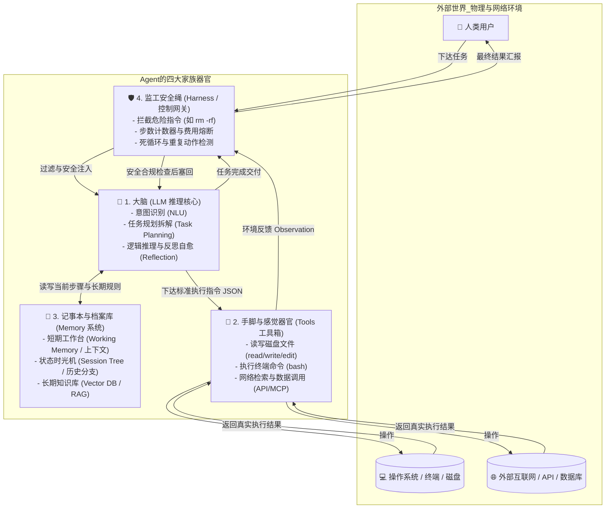

# 02. Agent 的四大核心部件——解剖一只能够上岗的“数字员工”

> **承接上篇**：  
> 在上一篇中，我们见证了 2023 年 AutoGPT 的悲壮翻车——仅靠几句 Prompt 和一个无休止的循环，大模型很快就会陷入死循环、烧穿钱包、走火入魔。  
> 为什么人类工程师在工位上干活从不会这样？因为人类的大脑周围，连接着完整而精密的**生理器官系统与行为纪律**。  
> 本篇我们将用“人体解剖学”的视角，彻底拆解一个能够在生产环境稳健跑通的 Agent，必须配备的 **4 大核心器官**。

---

## 一、 身体结构解剖全景：从“纯意识”到“有肉身”

---

## 二、 四大器官深度解剖与前世痛点

### 🧠 器官 1：聪明的大脑 (LLM 大语言模型)
- **它是什么**：Agent 的中央处理器（CPU / GPU 角色）。在当前工业界，通常是 DeepSeek-V3/R1、Claude 3.5 Sonnet、GPT-4o 或 Qwen-Max。
- **历史痛点（为什么过去做不到？）**：  
  在小模型时代（如 BERT、GPT-2），模型根本没有“规划”能力，你让它把一个任务拆成 3 步，它到第 2 步就前言不搭后语。现代前沿大模型通过海量代码和逻辑训练，才真正具备了 **思维链（Chain of Thought, CoT）** 和 **反思自愈能力（Reflection）**。
- **大脑在 Agent 里的核心动作**：
  1. **意图拆解**：“主人说‘修复登录 Bug’，那我必须先搜索相关文件，再定位代码，再修改，最后跑测试”；
  2. **决策裁决**：“面对当前屏幕上的报错，我是该继续调工具修，还是已经搞定可以直接交差了？”。

---

### 🦾 器官 2：灵活的手脚 (Tools 工具箱)
- **它是什么**：Agent 与数字世界产生物理交互的唯一桥梁。
- **历史痛点与演进（极其重要）**：
  - **原始野蛮期（2022 年底 - 2023 年初）**：  
    早期工程师怎么让大模型调工具？让大模型输出特定格式的字符串，比如 `Action: bash[ls -la]`，然后程序员用 Python 的正则表达式（Regex）去抠出中括号里的内容。  
    **结果惨不忍睹**：大模型偶尔多加了个空格、少了个引号，正则匹配就直接崩掉，系统频繁瘫痪。
  - **现代标准化（2023 年底至今）**：  
    OpenAI 与各大模型厂商推出了底层的 **Function Calling / Tool Calling 规范**。工具的入参和出参全部采用极其严密的 **JSON Schema** 协议。模型生成的每一个动作都是格式工整的合法 JSON，手脚终于不再“抽筋骨折”。
- **手脚的四大金刚**：
  1. `read_file`：看代码、看配置、看日志；
  2. `write_file`：从零落盘新建文件；
  3. `edit_file`：**极其讲究的局部精准替换**（避免全量重写带来的代码删失）；
  4. `bash`：敲终端命令、跑测试、打镜像。

---

### 📒 器官 3：随身记事本与时光机 (Memory 记忆系统)
- **它是什么**：解决大模型“金鱼记忆”和“走火入魔”的核心机制。
- **历史痛点与演进**：
  - 如果只用一个普通的数组存储对话历史（你问一句，AI答一句），当 Agent 在一个复杂 Bug 上尝试了 3 种方案都失败时，整个上下文会被那 3 种错误方案的脏代码填满。
  - 大模型看着满屏的错误代码，会产生强烈的**负面强化提示**，彻底迷失方向。
- **现代解法：三层立体记忆体系**：
  1. **短期工作便签（Working Memory）**：只存当前这 3 步最紧迫的上下文；
  2. **会话树时光机（Session Tree）**：把探索过程记录为树状分支。发现路线 A 走不通，**一键退回到 10 分钟前的分支起点**，把失败的脏记录打包丢进垃圾桶，干净利落地重启路线 B！
  3. **长期知识库（Vector RAG）**：把跨越几百页的开发手册存进向量数据库，用时随查。

---

### 🛡️ 器官 4：靠谱的监工安全绳 (Harness 控制系统)
- **它是什么**：**区分玩具 Agent 与商业级 Agent 的最大分水岭！**  
  很多人误以为 Agent 框架的技术含量在 Prompt 里，其实 **80% 的工业级工程量都在这个“监工安全绳（Harness）”里**。
- **为什么必须有监工？**  
  大模型本质上是一个不可预测的黑盒概率机，它随时可能犯蠢。监工就像工厂里的安全员，随时握着急停红色按钮：
  1. **防破产熔断**：单次任务限定最多执行 15 步。超过 15 步哪怕没搞定，立刻强制挂起，通知人类接管，防止一夜扣光万张发票；
  2. **防毁灭拦截**：在 `bash` 工具前加置安全白名单/黑名单网关。如果模型输出 `rm -rf /` 或企图把密码文件上传到公网，监工在内核层直接掐断；
  3. **死循环与重复动作打断**：如果检测到模型连续两次发出了完全一模一样的参数去调同一个工具，监工强制注入系统警告：“你正在进行无效的重复操作，请停下来反思，换一种新思路！”。

---

## 三、 四大器官缺一不可的“反面推演”

为了让你在架构设计时不再遗漏关键部件，请记住这张**器官缺失诊断表**：

| 如果我们省去... | Agent 会立即沦为... | 典型翻车实况 |
| :--- | :--- | :--- |
| **❌ 缺了大脑** | **脆弱生硬的旧式脚本** | 网页按钮的 id 从 `submit-btn` 稍微改成了 `commit-btn`，程序立刻报错崩溃，完全没有自适应能力。 |
| **❌ 缺了手脚** | **高位截瘫的书斋军师** | 能够给你洋洋洒洒写出 10 页完美的架构优化方案，但你电脑里的代码一个标点符号都没动，全得人类亲自去敲。 |
| **❌ 缺了记事本** | **睡醒就失忆的金鱼病人** | 刚写完文件 A，回过头执行命令 B 时就已经忘了自己刚才把文件放哪儿了，在同一个坑里反复跌倒。 |
| **❌ 缺了监工** | **脱缰狂奔的拆迁推土机** | 遇到网络抖动就死循环疯狂重试 1000 轮，不仅耗尽 API 额度，还可能在失控中把生产环境的数据库清空。 |

---

## 四、 承前启后：器官有了，血液怎么流动？

现在，你的脑海中已经有了一个完整的 Agent 躯体：
- 脑袋里有大模型（LLM）；
- 手上握着 Core Four 工具；
- 腰间别着可回退的记事本（Session Tree）；
- 身后系着牢固的安全绳（Harness）。

但这具身躯目前还是静止的。  
**究竟是什么驱动它一步一步主动思考、抬手调工具、看到结果后再做出下一步决策？**  
这就是 Agent 真正的心脏跳动机制——  
👉 **[01. Agent 是怎么自主干活的？(Agent Loop 运行原理)](../02-mechanisms/01-agent-loop.md)**
