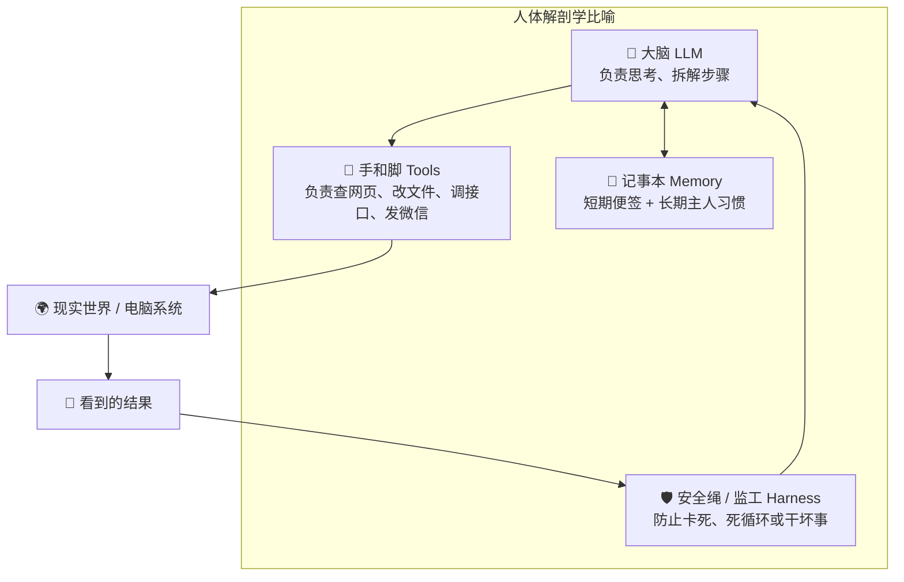

# 02. Agent 的四大核心部件

> **核心认知**：一个真正能独立做事的 Agent，身上有 4 个不可或缺的器官。

---

## 🧩 身体结构全景图

---

## 🔬 四大部件详解

### 1. 🧠 大脑 (LLM 大语言模型)
- **职责**：理解意图、逻辑推理、任务拆解。
- **例子**：主人说“帮我把项目跑起来”，大脑把它拆解为：“1. 检查有没有 node 环境 $\to$ 2. 执行 `npm install` 安装依赖 $\to$ 3. 执行 `npm run dev` 启动”。

### 2. 🦾 手脚 (Tools 工具)
- **职责**：与真实世界交互的桥梁。
- **为什么重要**：大模型自身没有网络开关，也没有硬盘读写权限。我们通过定义工具（如 `read_file`、`web_search`、`run_command`），大模型就能像发短信一样通知外部系统去执行具体动作。

### 3. 📒 记事本 (Memory 记忆系统)
- **短期记忆（工作便签）**：记录当前任务已经做到了第 3 步，防止刚做完上一秒就失忆。
- **长期记忆（专属档案）**：跨越不同天数的对话，记住用户的偏好（例如“主人习惯使用暗黑模式”、“主人喜欢用 TypeScript 语法”）。

### 4. 🛡️ 监工安全绳 (Harness 控制框架)
- **职责**：保障安全与稳定性。
- **防跑偏**：如果 Agent 遇到一个 Bug 重试了 5 次还在死循环，监工会强制按下暂停键；
- **防破坏**：如果 Agent 企图执行危险命令（如格式化硬盘、清空数据库），监工直接拦截报警。

---

## 🎯 一句话总结

$$\text{Agent} = \text{聪明大脑 (LLM)} + \text{灵活手脚 (Tools)} + \text{记忆小本 (Memory)} + \text{靠谱监工 (Harness)}$$
