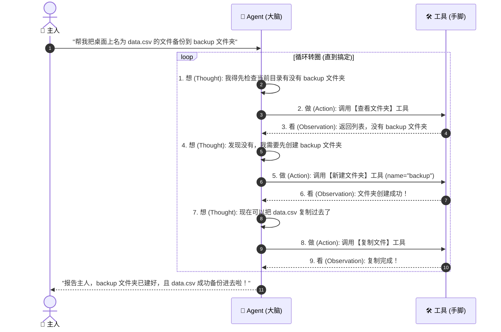

# 01. Agent 是怎么自主干活的？(Agent Loop 原理)

> **导读**：大模型是怎么一步一步自己把复杂任务做完的？其实它的底层就是一个“4步自运转圆圈”。

---

## 🔄 核心运转圆圈：想 $\to$ 做 $\to$ 看 $\to$ 纠错

学术上这套机制常被称为 **ReAct (Reasoning + Acting)** 范式，但用大白话讲，就是人做事的本能习惯：



---

## 💻 掀开神秘面纱：底层的极简代码骨架

你可能会觉得这套循环背后是不是有几十万行代码？其实最核心的引擎就长这样：

```typescript
// 真实的 Agent Loop 极简实现骨架 (JavaScript/TypeScript)
async function runAgent(userGoal) {
  let history = [{ role: 'user', content: userGoal }];
  
  while (true) {
    // 1. 让大脑思考，给出下一步动作
    const decision = await callLLM(history);
    
    // 2. 如果大脑觉得任务搞定了，退出循环并向用户汇报
    if (decision.isFinished) {
      return decision.finalAnswer;
    }
    
    // 3. 如果大脑要求调用工具，就真正去运行工具
    const toolResult = await executeTool(decision.toolName, decision.args);
    
    // 4. 把工具返回的结果记录到历史，供下一轮思考使用
    history.push({ role: 'tool', content: toolResult });
  }
}
```

---

## 🛡️ 为什么需要“最大轮次（Max Turns）”限制？

如果 Agent 遇到了一个死活解不开的死结（比如密码错误，一直重试），它会不会把你的电脑跑冒烟、或者把 API 费用刷爆？

**防范机制**：
我们在循环上加一个安全锁：`let turns = 0; while (turns++ < 20)`。  
如果转了 20 圈还没搞定，监工强制暂停，弹窗向人类求助：“主人，我试了 20 次没成功，似乎缺了某些权限，请帮我看看！”

---

## 🔗 动手体验代码
- 亲自运行一遍最小循环：[projects/mini-pi-agent/src/demo1-minimal-loop/index.ts](file:///d:/code/sanbox/AiAgentLearn/projects/mini-pi-agent/src/demo1-minimal-loop/index.ts)
