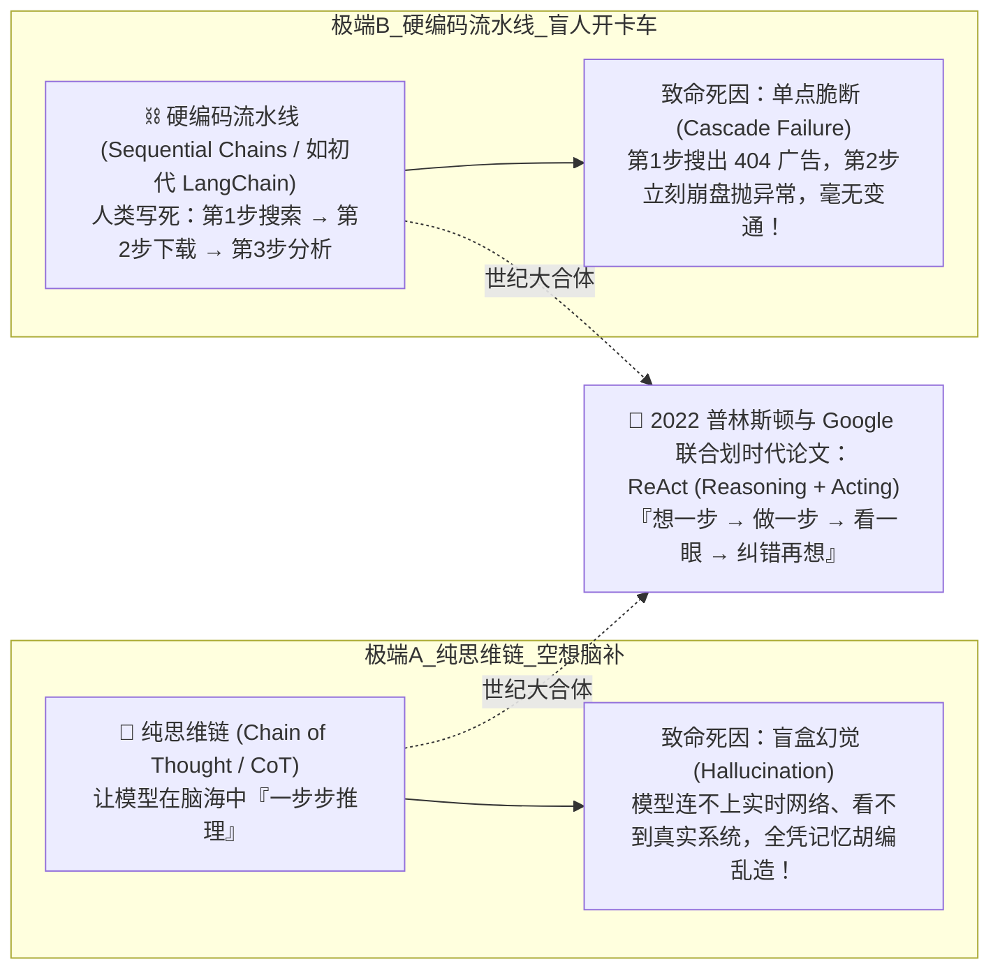
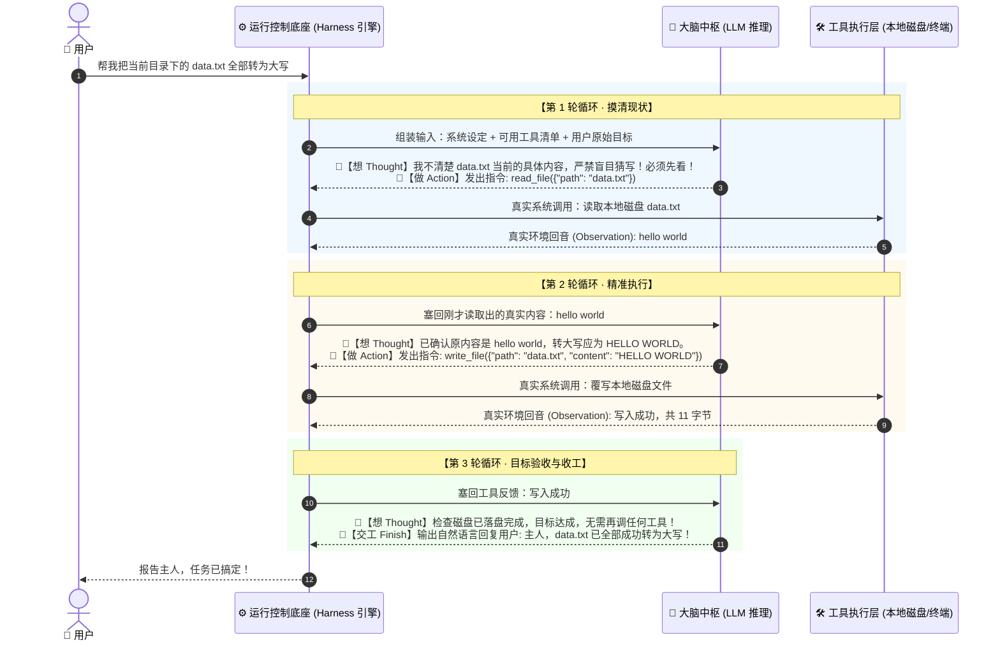
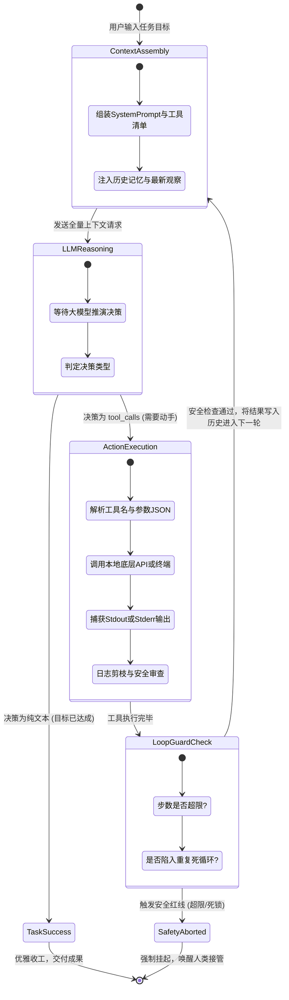

# 01. Agent 是怎么自主干活的？——从 ReAct 论文到自运转闭环

> **承接上篇**：  
> 在上一篇中，我们解剖了一只能够独立上岗的数字员工：大脑、手脚、记忆与控制护栏。  
> 但光把这四大器官静止地摆在桌面上，它还只是一具没有脉搏的机械骨架。  
> **究竟是什么神经机制在驱动大模型：遇到任务先思考、抬手调工具、看到报错自己反思，直到把事情办妥才收工？**  
> 为什么在 2022 年底，全世界顶尖的 AI 学者突然意识到：**“如果不把‘思考’和‘行动’死死咬合在一个循环里，大模型永远无法走出象牙塔”**？  
> 本篇我们将用侦探小说般的探案视角，揭秘现代所有 AI Agent 的核心动力源——**ReAct 范式与自运转闭环（Agent Loop）**。

---

## 一、 溯源：AI 解决现实问题时的“两极瘫痪”惨案

在 2022 年底 ChatGPT 刚席卷全球时，学术界和早期应用开发者曾陷入过一场长达半年的集体迷茫。  
当时人们尝试让大模型解决现实复杂任务（如：修复代码 Bug、运维排查故障、跨平台调研），结果分化出了两批走入死胡同的极端流派：



### 🔬 还原真实的微观翻车现场：为什么旧方案无一幸免？

#### 🩸 案发现场 1：纯思维链（CoT）的“一本正经胡说八道”
- **任务目标**：“请帮我排查为什么本地开发服务器的 8080 端口启动失败？”
- **模型的大脑推理**：
  大模型被要求“Step by step 深度思考”。它在脑海里疯狂推演：“8080 端口被占，通常是因为此前有一个 Node.js 进程没有正常退出。根据我的概率知识库，该进程的 PID 大概率是 14285，用户可以使用 `kill -9 14285` 杀死该进程。”
- **现实灾难**：  
  大模型活在虚拟概率世界里，**它根本没有眼睛去看用户电脑的真实任务管理器**！那个所谓的 `14285` 是它脑补出来的幻觉。如果用户信以为真地敲下这行命令，不仅端口没释放，反而可能把电脑上正在运行的音乐播放器给误杀了！

#### 🩸 案发现场 2：硬编码流水线（Chain）的“盲人开卡车”
- **任务目标**：“在必应上搜索最新财报，下载 PDF 并提取净利润。”
- **程序代码逻辑（早期 LangChain 经典死写法）**：
  ```python
  # 早期极度脆弱的单向链式调用
  urls = search_bing("某公司2025最新财报")      # 第 1 步
  pdf_data = download_file(urls[0])             # 第 2 步：无脑假定第 1 个结果绝对有效
  profit = extract_profit(pdf_data)             # 第 3 步
  ```
- **现实灾难**：  
  现实世界充满了不可控的随机噪声。第 1 个搜索结果往往是一个被风控拦截的验证码页面，或者一个需要付费登录的死链。  
  `download_file` 瞬间喷出了 `HTTP 403 Forbidden` 异常。因为路线是人类提前画死的“单向铁轨”，整套程序当场轰然倒塌！**只要现实世界有 1 毫米偏差，流水线立刻车毁人亡。**

### 💡 绝望中的破局灵感：人类侦探是怎么破案的？
面对这两个死胡同，2022 年 10 月，普林斯顿大学的姚顺宇（Shunyu Yao 等人）与 Google Brain 团队联名发表了改变整个 AI 产业格局的里程碑论文：  

> 📄 **论文原著**：[*ReAct: Synergizing Reasoning and Acting in Language Models*](https://arxiv.org/abs/2210.03629) (发表于 ICLR 2023)  
> 🌐 **官方项目主页**：[https://react-lm.github.io/](https://react-lm.github.io/)  
> 👥 **作者团队**：Princeton University (Shunyu Yao, Karthik Narasimhan) & Google Brain

---

### 🎯 划时代贡献：ReAct 到底切中要害，解决了什么核心问题？

在这篇论文诞生之前，整个 AI 界把“推理（Reasoning）”和“行动（Acting）”当成两条毫无交集的平行线。ReAct 的伟大之处在于，它用一套极其简洁优雅的交织范式，一举攻克了三大历史级痛点：

#### 1. 彻底根治了纯思维链（CoT）的“封闭空想幻觉”
- **过去痛点**：传统的思维链（Chain of Thought）只能在大模型闭卷训练的死记忆里打转。面对需要外部动态事实（如：最新股市行情、当前报错日志）的任务时，模型只能“越推理越自信地胡编乱造”。
- **ReAct 的破局**：在推理链条中强行嵌入一个外部动作（Action），拿到物理现实的真实反馈（Observation）。**用真实客观世界的反馈信号，随时校准大模型的思考轨道，彻底掐灭了幻觉滋生的温床。**

#### 2. 彻底终结了纯动作派（Action-Only）的“盲目与错误级联”
- **过去痛点**：传统的工具调用（如旧式 API 插件、硬编码流水线）完全没有思考缓冲区。一旦工具返回了一条 404 或超时报错，系统不知道为什么错，错误会像多米诺骨牌一样雪崩放大。
- **ReAct 的破局**：建立了 **`Thought -> Action -> Observation`** 的交替节律。大模型在每一次动手之前，**必须先用自然语言在脑海中‘沉思（Thought）’一段话**：“刚才那一步拿到的数据有效吗？我当前距离终点还有多远？如果刚才出错了，我该怎么调整策略？”——让行动有了理智的灵魂。

#### 3. 彻底打破了黑盒，赋予 Agent 前所未有的“可解释性与信任感”
- **过去痛点**：大模型执行外部任务如同一个漆黑的盲盒，人类根本不知道它下一步为什么突然去删某个文件、为什么去请求某个接口。
- **ReAct 的破局**：大模型每走一步的推演过程（Thought 轨迹）全部白纸黑字地打印在终端上。人类工程师可以像看实时日志一样，清晰监控它的思考脉络。一旦发现它的意图发生漂移，人类可以随时拉动电闸（Human-in-the-Loop）实施干预。

#### 4. 奠定了全世界所有现代智能体的“标准骨架协议”
- 论文提出的“推演（Thought） $\to$ 动作（Action） $\to$ 观察（Observation）”三位一体格式，成为了后来初代 LangChain Agent、AutoGPT、BabyAGI，以及如今现代 Coding Agent（如 Claude Code, Cursor, Antigravity, Pi Agent）不可撼动的**底层行为设计蓝图**！

---

论文指出了一个极其朴素但震撼人心的真理：  
**人类专家在解决未知复杂问题时，既不会闭着眼睛一直空想，也不会不带脑子盲目乱按按钮。**  
人类像老刑警破案一样，是一个精密交织的循环：  
1. **想 (Thought)**：根据现有线索，推测下一步最该寻找什么物证；
2. **做 (Action)**：走到现实物理世界中，翻开抽屉取证；
3. **看 (Observation)**：看一眼搜出来的到底是不是真凶的指纹；
4. **纠错 (Self-Correction)**：如果发现抽屉是空的，立刻推翻刚才的假设，调整思路换个房间再查！

---

## 二、 破局：ReAct 闭环在四大器官间的运转时序

这就是今天一切现代 Agent（Cursor、Claude Code、Mini Pi Agent）底层不知疲倦跳动的心脏：**ReAct 自运转闭环（Agent Loop）**。

下面用一个真实的“在工程目录中修改配置文件”场景，看 ReAct 是如何在各大器官之间咬合流转的：



---

## 三、 掀开黑盒：真实网络电缆里飞舞的 JSON 数据流

很多人学了很久 Agent，总觉得这个循环背后有什么玄学黑魔法。  
**其实，整个网络电缆里飞舞的，仅仅是几段格式工整的 JSON 数据包！**  
让我们撕开黑盒，看看在第一轮循环中，**宿主程序和大模型之间到底在用什么暗号通信**：

### 1. 宿主程序向大模型发起的初始请求包
> 注意：请求体中不仅包含了用户的提问，还附带了一份严密的**“工具说明书（JSON Schema）”**。

```json
{
  "model": "deepseek-chat",
  "messages": [
    { 
      "role": "system", 
      "content": "你是一个具备自愈能力的工程智能体。在完成目标前，请先思考推演，再决定调用何种工具。" 
    },
    { 
      "role": "user", 
      "content": "帮我看看 src/app.ts 的内容并告诉我端口是多少" 
    }
  ],
  "tools": [
    {
      "type": "function",
      "function": {
        "name": "read_file",
        "description": "读取指定文件的全部纯文本内容",
        "parameters": {
          "type": "object",
          "properties": {
            "path": { "type": "string", "description": "目标文件相对或绝对路径" }
          },
          "required": ["path"]
        }
      }
    }
  ]
}
```

### 2. 大模型给出的响应包（工具调用决策）
> 大模型在这个阶段**绝不会假装知道答案**，它会准确地输出一个标准的 `tool_calls` 结构：

```json
{
  "role": "assistant",
  "content": "我需要先读取该文件才能确认具体的服务端口。",
  "tool_calls": [
    {
      "id": "call_inspect_8892",
      "type": "function",
      "function": {
        "name": "read_file",
        "arguments": "{\"path\":\"src/app.ts\"}"
      }
    }
  ]
}
```

### 3. 本地宿主程序执行工具，并将真实环境回音喂回大模型
> 宿主程序拦截上面的 JSON，在本地运行 Node.js 读盘操作，并将真实文本以 `role: "tool"` 身份追加在消息末尾：

```json
{
  "role": "tool",
  "tool_call_id": "call_inspect_8892",
  "content": "const express = require('express');\nconst PORT = 8080;\napp.listen(PORT, () => console.log('Ready'));"
}
```
**看懂了吗？**  
大模型自己根本触碰不到硬盘，它是通过**“输出调用参数 $\to$ 宿主代为执行 $\to$ 结果塞回上下文”**这套标准协议，完成对物理世界的间接感知的！

---

## 四、 核心机制解密：单次工具调用与真正 Agent 的本质区别

很多初学者学到这里，往往会犯嘀咕：  
> *“既然各大模型厂商已经原生支持了 `tool_calls`（工具调用），那我不就是发一次 API 请求、调一个函数把结果打印出来吗？这有什么稀奇的，凭什么能叫智能体？”*

**答案是：调一次工具，根本算不上 Agent！**  
如果程序只跑一次工具调用，它充其量只是一个**“加了外挂的高级 Siri”**或者**“带腿的计算器”**。

---

### 1. 通俗比喻：【踢一脚动一下的木偶】 vs 【独当一面的贴心管家】

为了让你一眼看穿这两者的天壤之别，我们打一个极其贴近生活的比方：

#### 场景：你对它们下达同样一个目标：“帮我订一张明天下午去北京的高铁票”

- **🤖 方案 A：单步工具调用（踢一脚动一下的木偶 / 旧式 Siri）**
  - 它查了一下 12306，发现你想买的那趟车二等座**已经卖光了（遇到阻碍）**；
  - 它两手一摊，当场停在原地，直接弹出一行冷冰冰的提示：“查无余票，任务失败。”
  - **结果**：你还得自己打开手机去查别的班次，或者重新对它敲一条新指令。**它只做你吩咐的那单独一步，一旦遇到挫折就原地瘫痪。**

- **🧠 方案 B：真正的 Agent 循环（独当一面的贴心管家）**
  - 它查了 12306，看到二等座卖光（第 1 轮：动手拿到了坏消息）；
  - 它**绝不会停下来烦你，而是自己在脑子里盘算**：“主人要下午去北京，二等座没了，那一等座还有吗？或者晚半小时的高铁有票吗？”（第 2 轮：根据现场反馈，自己调整思路）；
  - 它立刻去查下一趟车（第 3 轮：再次动手调工具）；
  - 发现下一趟车有票，自动帮你锁单（第 4 轮：继续执行下一步）；
  - 最终拿着车票走过来对你说：“主人，原计划的车次没票了，我帮您抢了晚半小时的班次，已经订好啦！”（目标达成，收工交付）。

---

### 2. 用大白话看清两者的底层差异

把上面贴心管家的行为，换成程序员能听懂的大白话：

| 对比维度 | 单步工具调用 (Single Tool Call) | 真实的 Agent 循环 (Agent Loop) |
| :--- | :--- | :--- |
| **通俗形象** | **踢一脚才动一下的木偶**（听话但呆板） | **不达目的不罢休的管家**（自主且有韧性） |
| **代码本质** | 只发一次请求，执行完一个函数就退出了 | 放在一个 `while` 循环里，**一轮接一轮自转** |
| **遇到报错时** | 遇到网络 404 或参数错误，程序当场崩溃给你看 | **把报错当成新情报，自己反思为什么错，换个方法重试** |
| **什么时候收工？** | 工具跑完那 1 秒钟就立刻收工（不管事情成没成） | **直到把问题彻底搞定（或者达到安全红线）才收工** |

---

### 3. 宿主引擎内部像洗衣机一样流转的“五步状态机”

刚才我们说 Agent 会“一轮接一轮自转”，那它在代码内部到底是怎么一步步跳跃的？  
其实一点也不玄学，就像**全自动洗衣机（注水 $\to$ 浸泡 $\to$ 漂洗 $\to$ 脱水 $\to$ 烘干）**一样，宿主程序在每一轮循环里都在走固定的 5 个步骤：



---

### 3. 循环的灵魂：三大终止裁决机制 (Termination Criteria)

一个不会停机的 Agent 是极其危险的。Agent Loop 能够平稳自运转的前提，是控制底座中内置了严密的**三层终止裁决网关**：

#### ① 优雅完成收工（Natural Finish）
- **触发条件**：大模型读取了最新一轮工具返回的执行结果，在推演后判定：“所有预设指标已满足”。
- **表现形式**：大模型发出的响应中，`tool_calls` 为空（或不存在），取而代之的是包含最终解答的自然语言。引擎据此安全退出 `while` 循环。

#### ② 硬性步数熔断（Safety Steps Cutoff）
- **触发条件**：哪怕大模型依然觉得自己“马上就能搞定”，但循环计数器达到了预设的硬性上限（如 `step >= 10`）。
- **设计哲学**：在真实的工业生产中，必须假定“大模型随时可能犯蠢”。步数熔断是防止企业信用卡被刷爆、防止服务器 CPU 被打满的绝对底线。

#### ③ 死循环阻断（Loop Breaker）
- **触发条件**：引擎检测到大模型连续 2~3 轮发出了**完全一模一样的工具名与完全相同的参数**，且连续遭遇相同的失败。
- **设计哲学**：概率模型在特定 Prompt 陷阱下会陷入“复读机循环”。引擎在底层拦截这种重复动作，强制向模型注入警告：“你正在重复犯错，立刻停止当前方案，换一个全新角度！”，强行打破思维僵局。

---

## 五、 工业级 Agent Loop 的 20 行极简代码内核

在把所有花哨的企业级包装剥离之后，全世界所有 Agent（不管是百亿美元估值的 Devin，还是我们本项目的 Mini Pi Agent）底层最纯粹的代码内核，其实只有这么短：

```typescript
// 真实的 Agent Loop 极简工业级实现 (TypeScript)
async function runMinimalAgentLoop(userGoal: string) {
  // 1. 初始化对话历史与记忆
  const history: any[] = [
    { role: 'system', content: '你是具有自愈能力的 AI Agent，先推演再调用工具。' },
    { role: 'user', content: userGoal }
  ];

  const maxSteps = 10; // 控制底座安全护栏：硬性最大步数熔断，防止无限空转

  for (let step = 1; step <= maxSteps; step++) {
    console.log(`\n>>> 【Agent Loop 循环 · 第 ${step} 轮】 <<<`);

    // 2. 🧠 大脑推理：根据当前全量历史推演下一步 (Reasoning)
    const response = await callLLM(history);

    // 3. 🏁 退出条件：如果大脑判定无需再调工具，说明任务搞定，直接交付！
    if (!response.tool_calls || response.tool_calls.length === 0) {
      console.log(`[Agent 交付成果]: ${response.content}`);
      return response.content;
    }

    // 4. 将大模型的思考与动作意图记入历史
    history.push(response);

    // 5. 🦾 手脚行动：逐个执行工具调用 (Acting)
    for (const call of response.tool_calls) {
      const toolName = call.function.name;
      const args = JSON.parse(call.function.arguments);
      
      // 真实运行本地系统调用
      const observation = await executeLocalTool(toolName, args);

      // 6. 👀 环境观察：将现实反馈以 tool 身份塞回历史，供下一轮反思！(Observation)
      history.push({
        role: 'tool',
        tool_call_id: call.id,
        content: observation
      });
    }
  }

  throw new Error("⚠️ 达到安全熔断步数上限，控制底座强制终止以防死循环！");
}
```

---

## 💡 六、 小白一分钟自测

> **【深度思考题】**：为什么在上面的代码中，只要大模型发起了 `tool_calls`，这个循环最少也必须执行 **2 轮**？为什么绝对不可能在第 1 轮就把带工具的任务彻底做完？

<details>
<summary>👉 点击展开看答案解析</summary>

- **核心原因在于“物理世界的因果先后性”**：  
  - **第 1 轮**：大模型第一次拿到用户的提问，它必须做出决策：“我不知道具体信息，请宿主帮我调用 `read_file` 工具”。此时工具**尚未被本地系统执行**，大模型不可能预知未来读出来的文本是什么！  
  - 宿主程序执行了文件读取，拿到真实的 `Observation` 文本并追加回历史；  
  - **第 2 轮**：大模型重新阅读包含 `Observation` 的历史，看到真实内容后，才能确认目标达成，输出自然语言并结束循环。  
  因此，任何涉及到真实行动的 Agent 任务，**至少需要 2 轮以上的自运转回路！**
</details>

---

## 七、 承前启后：工具的标准插座在哪里？

读到这里，你已经彻底搞懂了 Agent 的动力引擎是如何通过 ReAct 循环跳动起来的。  
但敏锐的你一定会发现一个巨大的工程隐患：  
- 在上面的代码中，工具是写死在本地环境里的；
- 如果明天你想让 Agent 连接 GitHub 查看代码、连接 PostgreSQL 查数据、连接微信发消息，难道每个系统都要手写一套适配层吗？
- 为什么过去整个 AI 行业饱受“各个框架工具互不相通”的折磨？  
这就是为什么在 2024 年底，Anthropic 推出了被誉为**“AI 时代 Type-C 统一插口”**的划时代标准——  
👉 **[02. 给 Agent 装上手脚：工具调用与 MCP 协议的前世今生](02-tools-and-mcp.md)**
