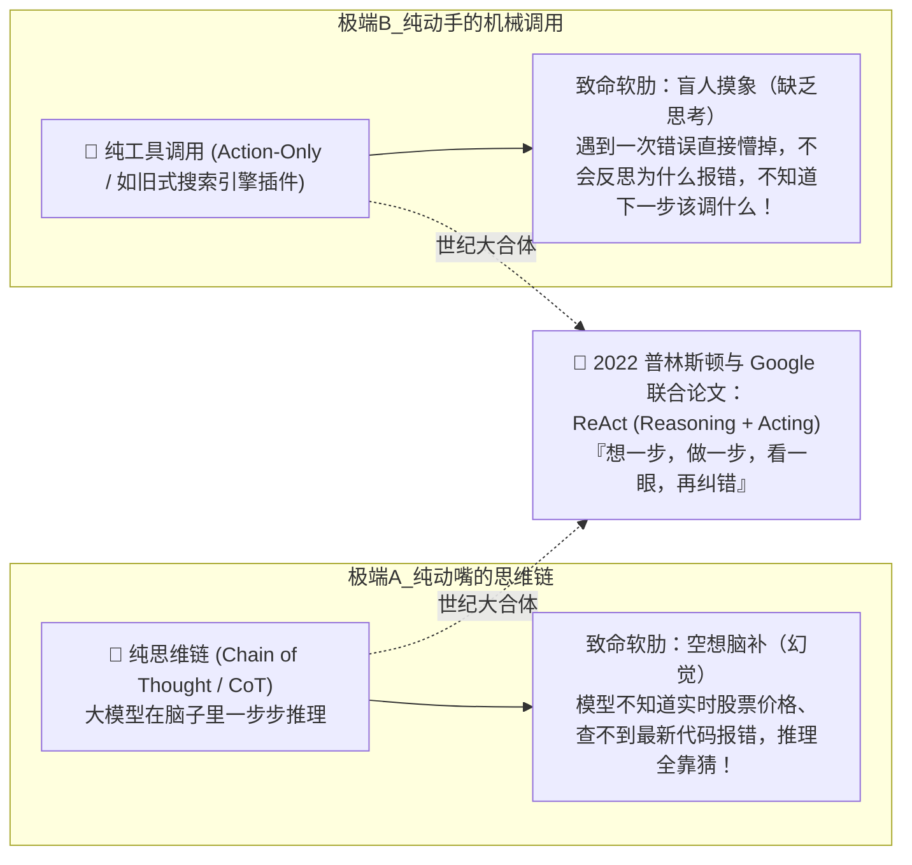

# 01. Agent 是怎么自主干活的？——从 ReAct 论文到自运转闭环

> **承接上篇**：  
> 在上一篇中，我们解剖了 Agent 的四大器官。  
> 但光把器官拼在一起，它还只是一具雕像。要让它真正“活过来”，必须让神经冲动在器官之间循环流动。  
> 为什么现代所有可用的 Agent 框架，底层无一例外都在跑同一个机制？  
> 本篇我们将回到 2022 年那篇奠定现代智能体基石的学术里程碑，揭秘 **Agent Loop（自主运行循环）** 的前世今生与底层代码机制。

---

## 一、 溯源：ReAct 范式诞生的历史困境

在 2022 年底 ChatGPT 刚火爆全球时，学术界和工业界遇到了两个互相排斥的极端难题：



### 1. 极端 A：纯粹的思维链（CoT）——博学但脱离现实的空想家
当时人们发现，只要在 Prompt 里加一句“请一步步思考（Let's think step by step）”，大模型的逻辑推理能力就大幅提升。  
但是，**大模型没有眼睛和耳朵，它的训练数据是截止的**。如果它遇到一个现实问题（比如：“我的服务端口 8080 被谁占用了？”），它脑子里的思维链再精彩，也只能在脑海里“凭空编造”一个 PID，导致严重的**大模型幻觉（Hallucination）**。

### 2. 极端 B：纯粹的动作派（Action-only）——盲人摸象的鲁莽打工人
另一拨人尝试直接给大模型接 API，让大模型只输出工具命令。  
但一旦命令执行报错（比如网络超时、参数拼写错误），大模型完全没有思考和反思的过程，根本不知道错误因何而起，系统瞬间休克。

### 3. 历史性突破：ReAct (Reasoning + Acting) 的横空出世
2022 年 10 月，普林斯顿大学与 Google 团队发表了划时代的论文《ReAct: Synergizing Reasoning and Acting in Language Models》。  
论文提出核心思想：**人类在解决现实世界复杂问题时，从来不是一口气把整盘棋下完，而是“想一下 $\to$ 走一步 $\to$ 观察对手反应 $\to$ 再想下一步”！**

这就是现代所有 Agent 的永动机：**ReAct 循环**！

---

## 二、 核心运转时序：想 $\to$ 做 $\to$ 看 $\to$ 纠错

用一个最真实的软件排错场景，看 ReAct 是如何在四大器官之间流转的：

```mermaid
sequenceDiagram
    autonumber
    actor User as 🧑 用户
    participant Loop as ⚙️ Agent Loop 引擎 (Host)
    participant LLM as 🧠 大脑 (LLM 推理)
    participant Tool as 🛠️ 现实工具 (本地文件/终端)

    User->>Loop: "帮我把当前目录下的 data.txt 全部转为大写"
    
    rect rgb(240, 248, 255)
        Note over Loop,Tool: 循环第 1 轮：先摸清现状 (Observation 0)
        Loop->>LLM: 历史记录 + 当前目标
        LLM-->>Loop: 【想 Thought】我不清楚文件里有什么，必须先调用 read_file 工具。<br/>【做 Action】call: read_file({"path": "data.txt"})
        Loop->>Tool: 本地执行 fs.readFileSync("data.txt")
        Tool-->>Loop: 【看 Observation】"hello world"
    end

    rect rgb(255, 250, 240)
        Note over Loop,Tool: 循环第 2 轮：执行修改 (Observation 1)
        Loop->>LLM: 塞回读取结果: "hello world"
        LLM-->>Loop: 【想 Thought】原内容是 hello world，大写为 HELLO WORLD。<br/>【做 Action】call: write_file({"path": "data.txt", "content": "HELLO WORLD"})
        Loop->>Tool: 本地执行 fs.writeFileSync("data.txt", "HELLO WORLD")
        Tool-->>Loop: 【看 Observation】"写入成功，共 11 字节"
    end

    rect rgb(240, 255, 240)
        Note over Loop,LLM: 循环第 3 轮：任务验收并交付
        Loop->>LLM: 塞回写入成功通知
        LLM-->>Loop: 【想 Thought】文件已成功覆盖，目标达成，无需再调用任何工具！<br/>【结束 Finish】向用户汇报: "已成功将 data.txt 转换为大写！"
    end

    Loop-->>User: "报告主人，任务已搞定！"
```

---

## 三、 掀开黑盒：网络电缆里真实的 JSON 数据流

很多人学了半天 Agent，不知道它在电缆里跑的到底是什么。下面是第 1 轮循环中，**大模型与宿主程序之间真实飞舞的数据包**：

### ① 宿主程序打包请求发往大模型：
```json
{
  "model": "deepseek-chat",
  "messages": [
    { "role": "system", "content": "你是一个严谨的 Coding Agent，必须先想后做，完成目标方可退出。" },
    { "role": "user", "content": "帮我看看 src/app.ts 的内容" }
  ],
  "tools": [
    {
      "type": "function",
      "function": {
        "name": "read_file",
        "description": "读取指定文件的文本内容",
        "parameters": {
          "type": "object",
          "properties": {
            "path": { "type": "string", "description": "文件相对或绝对路径" }
          },
          "required": ["path"]
        }
      }
    }
  ]
}
```

### ② 大模型响应：它不是输出人话，而是输出结构化的调用指令：
```json
{
  "role": "assistant",
  "content": "我需要先读取该文件以了解其具体实现。",
  "tool_calls": [
    {
      "id": "call_9981",
      "type": "function",
      "function": {
        "name": "read_file",
        "arguments": "{\"path\":\"src/app.ts\"}"
      }
    }
  ]
}
```

### ③ 本地代码拦截并执行，把真实读盘结果以 `role: "tool"` 身份追加回历史：
```json
{
  "role": "tool",
  "tool_call_id": "call_9981",
  "content": "const express = require('express');\nconst app = express();"
}
```

---

## 四、 工业级 Agent Loop 的极简代码内核

褪去所有复杂的装饰，一个真正可用的 Agent 循环引擎的核心骨架只有 20 行：

```typescript
// 真实的 Agent Loop 极简工业级骨架 (TypeScript)
async function runAgentLoop(userGoal: string) {
  const history: any[] = [
    { role: 'system', content: '你是具有自愈能力的 AI Agent' },
    { role: 'user', content: userGoal }
  ];

  const maxSteps = 10; // 监工安全绳：最多允许自循环 10 轮

  for (let step = 1; step <= maxSteps; step++) {
    // 1. 让大脑根据历史推演下一步 (Reasoning)
    const response = await callLLM(history);

    // 2. 如果大脑判定任务搞定，退出循环交付成果
    if (!response.tool_calls || response.tool_calls.length === 0) {
      return response.content;
    }

    // 3. 将模型的思考与意向加入历史
    history.push(response);

    // 4. 执行手脚动作 (Acting)
    for (const toolCall of response.tool_calls) {
      const toolName = toolCall.function.name;
      const args = JSON.parse(toolCall.function.arguments);
      
      // 真实运行本地工具
      const observation = await executeLocalTool(toolName, args);

      // 5. 将现实反馈塞入历史，进入下一轮循环！(Observation)
      history.push({
        role: 'tool',
        tool_call_id: toolCall.id,
        content: observation
      });
    }
  }

  throw new Error("⚠️ 警告：已达到最大步数限制，监工强制终止防止失控！");
}
```

---

## 五、 承前启后：工具的接口怎么才能统一？

看到这里，你已经搞懂了 Agent 的心脏是如何通过 `while` 循环跳动的。  
但是，在上面的时序图中，大模型是怎么知道本地有 `read_file`、`write_file` 这些工具的？  
如果我们要给它接入飞书、接入 GitHub、接入数据库，难道每一个小功能都要程序员写一套适配代码吗？  
这就是为什么整个 AI 工业界在 2024 年掀起了一场**“统一接口标准革命”**——  
👉 **[02. 给 Agent 装上手脚：工具调用与 MCP 协议](02-tools-and-mcp.md)**
