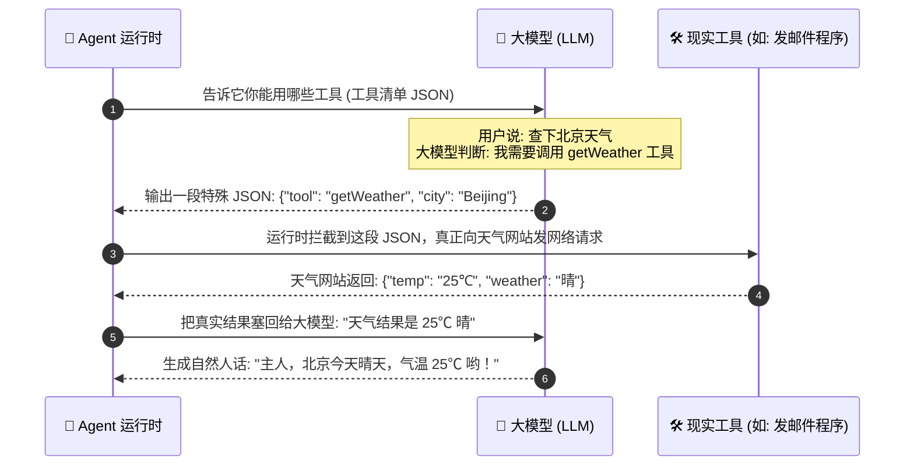

# 02. 给 Agent 装上手脚：工具调用与 MCP 协议

> **导读**：大模型本质上只是一个“文本预测器”，它是怎么跨越虚拟世界去操作现实中的软件、数据库和电脑文件的？

---

## 🔌 1. 工具调用（Tool Calling）的本质

大模型并不能直接敲击你的键盘，也不能直接连上你的数据库。所谓的“调用工具”，其实是**两段标准化的文本对话协议**：

---

## 🧩 2. 什么是 MCP 协议？（通俗大白话）

你可能经常听到一个新词叫 **MCP (Model Context Protocol)**。

- **过去**：每做一个 Agent，开发者都要给它专门写一遍天气工具代码、微信工具代码、GitHub 工具代码，各个软件互不相通，非常繁琐。
- **MCP 就像 Type-C 统一插口**：它规定了一套标准的“插头规范”。各种软件（数据库、代码仓库、搜索引擎）只要做成一个 MCP 插件，任何 Agent 只要插上就能直接用，再也不用重复造轮子！

---

## 🛠️ 3. 编程中最核心的“四大金刚”工具 (Core Four)

在编写能帮我们写代码、做运维的智能体时，最常用的 4 样核心手脚是：

1. **`read_file` (读文件)**：只能看文件内容，不破坏系统；
2. **`write_file` (写文件)**：全新创建文件；
3. **`edit_file` (改文件)**：在指定文件的具体位置精准替换几行代码；
4. **`execute_bash` (跑命令)**：在终端里运行测试、打包编译或拉取 Git 代码。

---

## 🔗 动手体验代码
- 体验四大核心工具的代码实现：[projects/mini-pi-agent/src/demo2-tools/index.ts](file:///d:/code/sanbox/AiAgentLearn/projects/mini-pi-agent/src/demo2-tools/index.ts)
