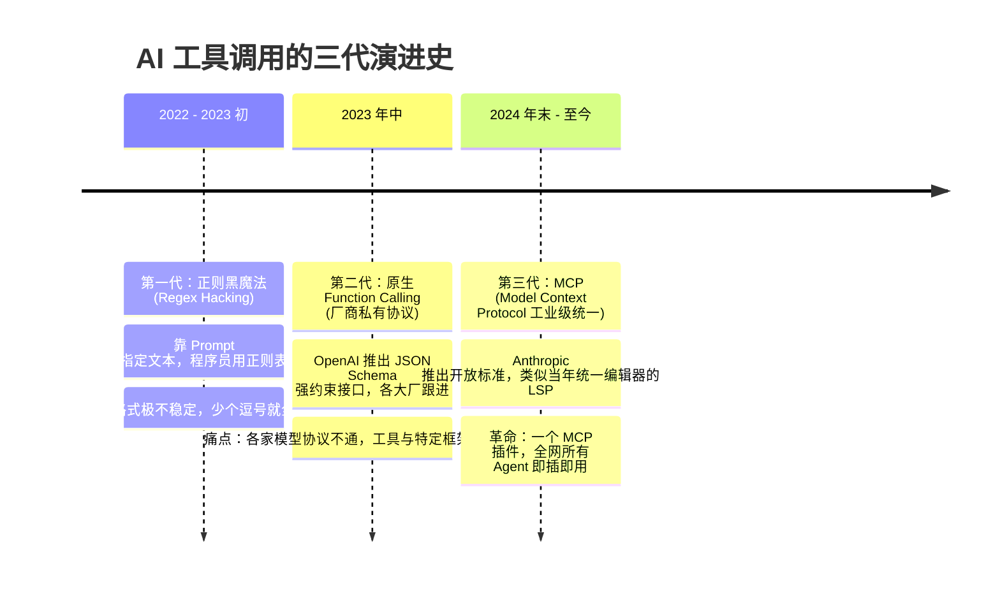
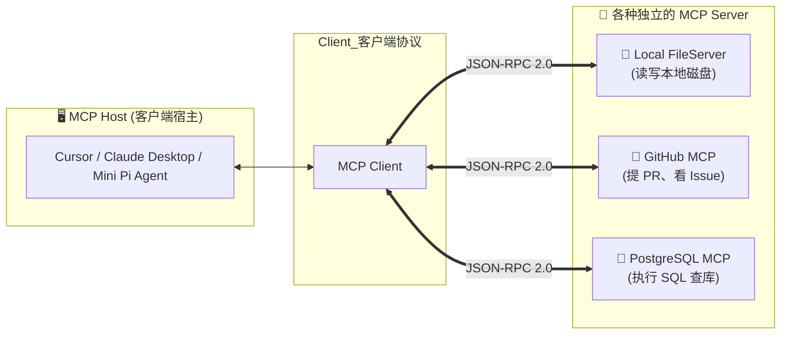
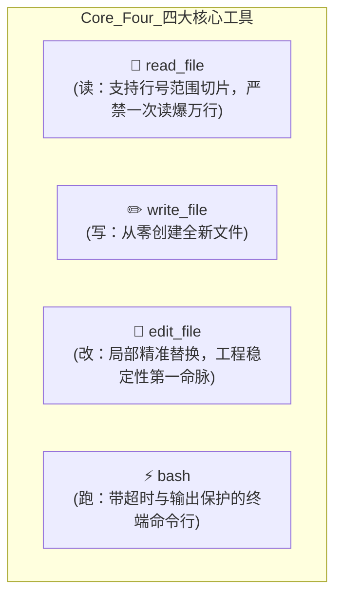

# 02. 给 Agent 装上手脚：工具调用与 MCP 协议的前世今生

> **承接上篇**：  
> 在上一篇中，我们看到了 Agent Loop 是如何通过 `tool_calls` 和 `Observation` 驱动自运转的。  
> 但不知道你有没有想过一个灵魂问题：  
> **如果世界上有 100 种大模型客户端，而外部有 10,000 种软件（微信、GitHub、数据库、高德地图），难道开发者要写 $100 \times 10,000 = 1,000,000$ 套接口吗？**  
> 为什么微软当年靠 LSP（语言服务器协议）统一了整个编程世界的语法高亮？  
> 为什么 Anthropic 推出的 **MCP (Model Context Protocol)** 被誉为“AI 时代的 LSP 统一革命”？  
> 本篇我们将彻底讲透工具调用的技术演进与 MCP 的底层设计哲学。

---

## 一、 溯源：工具协议的三代血泪史

大模型连接外部工具的演进，经历了三段波澜壮阔的技术代际：

### 1. 第一代（2022 - 2023 初）：痛苦的“正则黑魔法”
在 2023 年初，大模型本身是不支持结构化输出的。开发者只能在 System Prompt 里卑微地哀求大模型：
> *“请你务必严格按照格式输出：`Tool: read_file, Args: [path]`，千万不要输出多余的废话！”*

然后，程序员在后端写上一大串晦涩的正则表达式（Regex）去解析输出。  
**结果**：大模型只要稍微热情一点，前面加了一句“好的主人，我为您调用工具：”，整个正则就匹配失败，系统瞬间抛出 Uncaught Exception 崩溃。

### 2. 第二代（2023 年中）：厂商的原生 Function Calling
2023 年 6 月，OpenAI 在 GPT-4 上正式推出了 **Function Calling** 机制。  
这是人工智能工程史上的关键时刻——**模型底层被专门训练并微调了对 JSON 语法的严格遵从性**。  
开发者只要用标准的 **JSON Schema** 描述函数参数，大模型就能输出 100% 合法的 JSON。  
**新的痛点出现了（生态割裂）**：  
LangChain 写了一套工具格式，AutoGen 写了另一套，CrewAI 又自创了一套。如果你为 LangChain 写了一个“查天气插件”，换到其他框架里完全不能用，全世界的开发者都在重复造轮子！

### 3. 第三代（2024 年底至今）：MCP 协议的统一大业
2024 年底，Anthropic（Claude 背后公司）开源了 **MCP (Model Context Protocol，模型上下文协议)**。  
这一协议的野心极其宏大——**它要复制当年微软在 VS Code 上的绝世神话：LSP（Language Server Protocol）！**

> 💡 **科技史注脚：什么是 LSP？**  
> 以前，每出一个新编辑器（Sublime、VS Code、Vim），都要为每种语言（Python、Java、Rust）单独开发一套代码高亮和跳转插件（$N \times M$ 难题）。  
> 微软创造了 LSP 协议，规定只要语言官方提供一个 LSP Server，任何编辑器（LSP Client）只要插上就能支持该语言的所有语法！VS Code 借此一统天下。

**MCP 就是 AI 界的 LSP！**  
它基于标准的 **JSON-RPC 2.0 协议**。高德地图只需要写一个“高德 MCP Server”，不管是 Claude Desktop、Cursor、Antigravity 还是你自己手搓的 Mini Pi Agent，直接插上就能一秒接入高德地图！

---

## 二、 剖析：MCP 架构与三大核心能力

MCP 的核心架构极其清晰，它把复杂的系统解耦为三个角色：

### MCP 规范赋予大模型的三种底层超能力（Primitives）：

| 核心能力 | 对应行为 | 通俗生活比喻 |
| :--- | :--- | :--- |
| **1. Tools (工具)** | **写操作 / 主动动作**：执行计算、发邮件、创建分支、写数据库 | 你的**双手和双脚**，能对现实世界发起改变。 |
| **2. Resources (资源)** | **读操作 / 被动数据**：只读文件、系统当前环境变量、业务日志流 | 你的**眼睛和眼镜**，只负责看，不产生副作用。 |
| **3. Prompts (预设模版)** | **专家模式 / 引导词**：一键调起“代码审查模式”、“单元测试生成模版” | 你的**职业培训手册**，一翻开就知道按什么规范干活。 |

---

## 三、 实战：软件研发必备的“四大金刚”工具 (Core Four)

在智能体写代码、运维系统的实战中，哪怕工具千千万，最核心、最不可或缺的底层手脚只有 **4 个**（这也是我们实战项目 `mini-pi-agent` 中手搓的核心）：

### 为什么 `edit_file` 是工业级 Agent 的生死线？
很多小白自制 Agent 时，喜欢只做一个 `write_file`，遇到改代码就让模型把整个文件重写一遍。  
**这是生产环境的绝对大忌！**
1. **幻觉删代码**：当一个文件有 2,000 行，你让大模型全量重写时，大模型经常会在中间写下一行：`// ... (中间 500 行保持不变) ...`，结果你的核心业务代码被永久抹去！
2. **延迟与费用灾难**：改一个变量名只需消耗 10 个 Token，全量重写要消耗 3,000 个 Token，速度慢 50 倍，成本高 100 倍！  
**因此，成熟的 Coding Agent 永远使用带锚点校验的局部精准替换（Atomic Edit）。**

---

## 四、 承前启后：工具执行完了，记忆该往哪儿放？

现在，大模型已经可以通过标准的 JSON 接口在你的电脑上自如地调用这四大工具了。  
但随着循环一轮接一轮地跑，新的危机浮出水面：  
- 如果 Agent 尝试了某种修改方案，运行测试后发现代码报错了，该怎么办？
- 难道要把之前尝试失败的几百行错误代码一直堆在聊天历史里吗？大模型被这些错误代码误导了怎么办？  
**人类在走错路时可以按 `Ctrl+Z` 撤销，Agent 怎么才能拥有一台“允许后悔的时光机”？**  
请看下一篇——  
👉 **[03. 给 Agent 装上记事本：记忆系统与知识库 RAG](03-memory-and-rag.md)**
