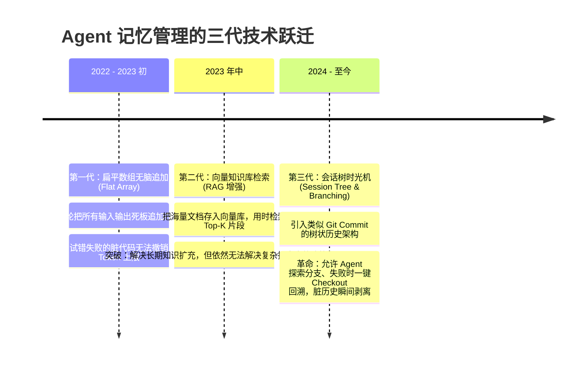
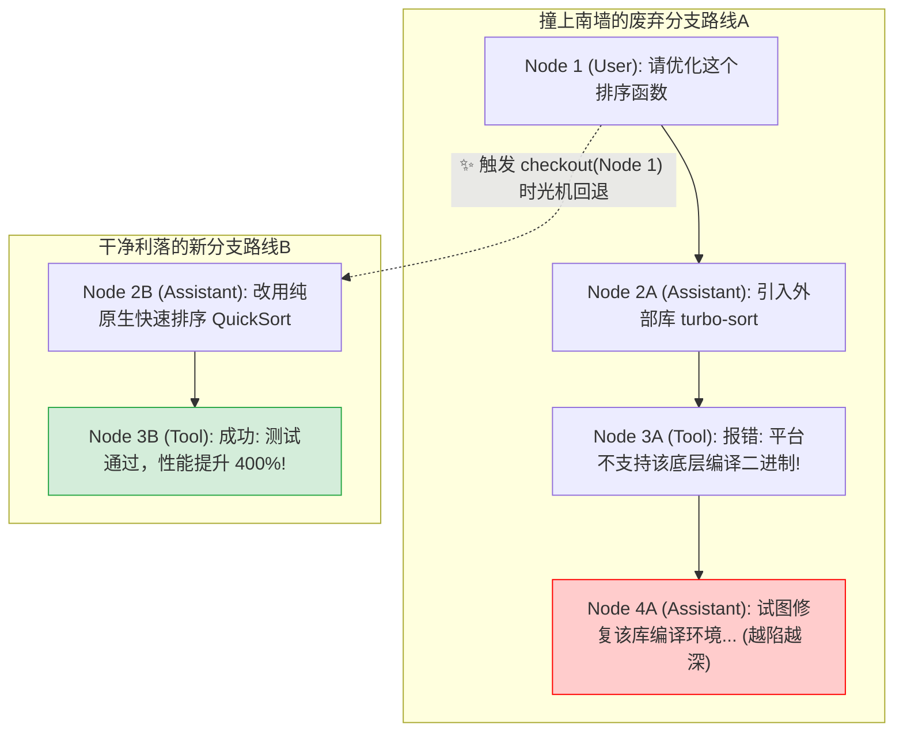

# 03. 给 Agent 装上记事本：记忆系统、RAG 与会话树的前世今生

> **承接上篇**：  
> 在上一篇中，我们给 Agent 配齐了 Core Four 核心工具与 MCP 标准插座。  
> 但大模型（LLM）底层在本质上是**完全无状态的（Stateless）**——每一次向 API 发送请求，大模型都不会记得你 1 秒钟前对它说过什么。  
> 如果只用一个简单的扁平数组堆叠对话，Agent 很快就会面临**“走入死胡同无法撤销”**和**“面对海量业务文档茫然失措”**的双重困境。  
> 本篇我们将探讨 Agent 的记忆革命：从向量开卷考（RAG）到像 Git 一样允许后悔的时光机（会话树 Session Tree）。

---

## 一、 溯源：无状态的大模型与记忆的三次技术跃迁

在普通的 Web 网站开发中，服务器靠 Session 和 Cookie 记住登录用户；但大模型完全不同：
- OpenAI 的 `/v1/chat/completions` 是一个**纯数学概率函数**：$y = f(x)$。
- 它不存任何状态，每一次你以为的“多轮对话”，其实都是前端代码把**过去的全部聊天记录打包成一个巨大的数组，一股脑重新发给它**！

这种原始做法，在普通聊天中勉强够用，但在自主干活的 Agent 场景下迅速崩塌：



---

## 二、 长期记忆的破局：RAG（检索增强生成）深度拆解

> 📜 **学术溯源**：2020 年，Facebook AI Research (FAIR) 发表论文《Retrieval-Augmented Generation for Knowledge-Intensive NLP Tasks》，首次确立了 RAG 的基本架构。

### 为什么大模型必须“开卷考试”？
很多初学者常问：“为什么不直接把我们公司的 1,000 页规章制度和几百万行业务代码，重新训练（微调 Fine-tune）进大模型里？”
1. **死贵且极慢**：重新微调一次需要耗费昂贵的算力，耗时几天到几周；
2. **知识无法实时更新**：明天公司制度修改了一条，大模型无法即时感知；
3. **幻觉无法根除**：微调只能调整模型的语言风格和通用领域概率，对于“工号 1024 昨天的报销单号是多少”这种精确事实，模型依然会产生幻觉胡编乱造。

**RAG 的解法极其接地气——开卷考试！**

```mermaid
flowchart TD
    subgraph 离线准备阶段_把图书编入图书馆
        Doc[企业万页文档 / 巨量代码库] --> Chunk[1. 文本切块 Chunking<br/>(按段落切成 300 字小卡片)]
        Chunk --> Embed[2. 向量化 Embedding<br/>(把文字转化为空间数学坐标)]
        Embed --> VDB[(3. 存入向量数据库<br/>Milvus / Chroma / pgvector)]
    end

    subgraph 实时问答阶段_开卷翻书考试
        UserQ[用户提问: 怎么报销探亲差旅费?] --> QEmbed[计算提问的空间坐标]
        QEmbed -->|余弦相似度检索| VDB
        VDB --> TopK[精准命中 Top-3 最相关段落卡片]
        TopK --> PromptAssemble["把卡片塞入提示词:<br/>『请严格参考以下材料回答，禁止脑补: [材料内容]』"]
        PromptAssemble --> LLM[🧠 大模型]
        LLM --> Answer[输出 100% 准确的人话回答]
    end
```

---

## 三、 动态试错的破局：会话树（Session Tree）时光机

RAG 解决了“静态长知识”的检索，但没有解决 Agent 在干活时的**“动态走弯路”**问题。

### 真实惨案：没有会话树的扁平对话是如何毁灭 Agent 的？
假设你让 Agent：“重构一个性能很慢的排序函数”。
- Agent 方案 A：尝试改用某种极其前卫的第三方开源库。
- 结果：安装该库后，发生了恶性依赖冲突，终端喷出了 300 行红字报错。
- **在扁平数组下**：这 300 行报错和失败的代码被永久黏在历史里。Agent 看着这堆垃圾报错，脑子转不过来，开始疯狂尝试去修这个第三方库的底层 Bug，**离最初的重构目标越来越远，彻底走火入魔！**

### 会话树架构：把 Git 分支思维引入 Agent 历史
在先进的 Coding Agent（如 Pi Agent、Antigravity）中，对话历史不是列表，而是一棵**树（Tree）**：
- 每一个节点（Node）都有唯一的 `id` 和指向父节点的 `parentId`；
- 维护一个类似 Git HEAD 的**游标（Current Cursor）**；
- 当路线 A 撞了南墙，Agent 或人类可以调用 **`checkout(node_id)`**：
  **游标瞬间弹射回尝试方案 A 之前的那个初始节点！**
  失败的 300 行报错被彻底隔离在分支废墟里，当前的主干视线（Mainline History）立刻恢复最初的冰清玉洁！



---

## 四、 承前启后：记忆越来越长，怎么防止被撑爆？

会话树解决了“走弯路后的回退”；  
RAG 解决了“海量外部文档的检索”。  
但是，哪怕是在顺利执行的主干线路上，**随着任务进入第 5 步、第 10 步，累计的执行日志依然会越来越长**。  
- 当一次命令执行输出了 2000 行日志，该怎么塞进大模型？
- 为什么即使是最新的百万 Token 模型，看长文本依然会“走神糊涂”？  
这就需要我们学习现代 Agent 最精妙的绝技——  
👉 **[04. 怎样把信息喂给 Agent？(上下文工程与 Token 剪枝)](04-context-engineering.md)**
