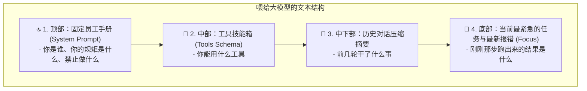

# 04. 怎样把信息喂给 Agent？(上下文工程与 Token 剪枝)

> **导读**：大模型的“注意力”就像一个桌面，桌面上堆满垃圾信息，大模型就会犯傻（迷失在中间）。上下文工程就是学会怎么整理这张桌面。

---

## 🧹 1. 桌面整理术：信息的黄金排布法则

把信息喂给大模型时，不同类型的信息应该放在不同的位置：

> **重要原则**：  
> 大模型对**最开头**和**最结尾**的信息记得最清楚，对中间密密麻麻的一大堆文字容易“走神”。因此关键指令和最新报错一定要放在最显眼的位置！

---

## ✂️ 2. Token 剪枝与上下文压缩（给桌面瘦身）

当 Agent 运行命令 `cat logs.txt` 打印了 1 万行日志时，整个上下文瞬间就被撑爆了，既花钱又容易让模型变笨。

### 怎么给日志瘦身？
1. **掐头去尾**：保留前 20 行和最后 30 行（报错堆栈通常在末尾），中间内容用 `[已省略 950 行内容...]` 替代；
2. **生成摘要**：前 10 轮的历史细节已经过去了，Agent 自动把它们概括成一句话：“前 10 步已成功安装依赖并排除了网络故障”，腾出宝贵空间。

---

## 🔗 动手体验代码
- 体验上下文压缩与剪枝算法：[projects/mini-pi-agent/src/demo4-compression/index.ts](file:///d:/code/sanbox/AiAgentLearn/projects/mini-pi-agent/src/demo4-compression/index.ts)
