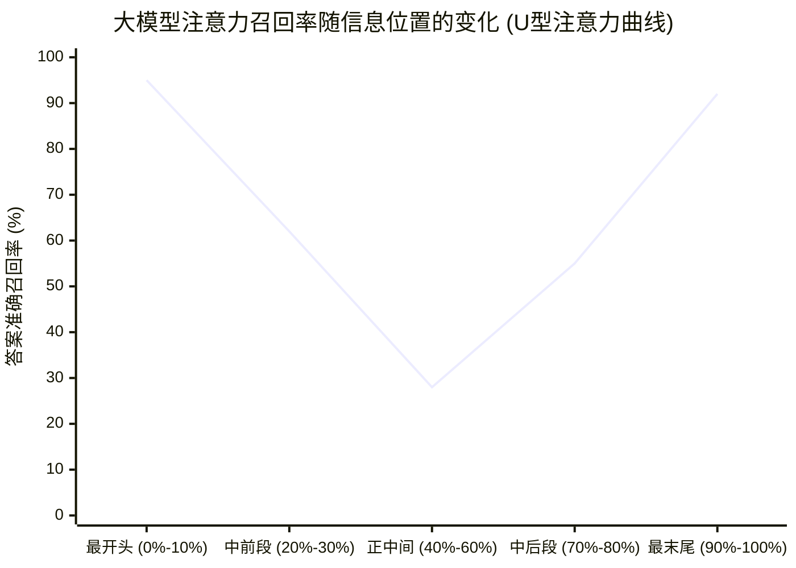
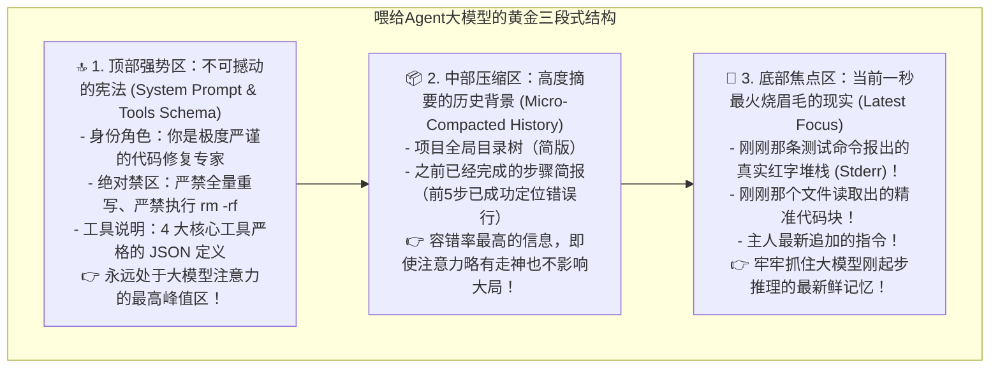
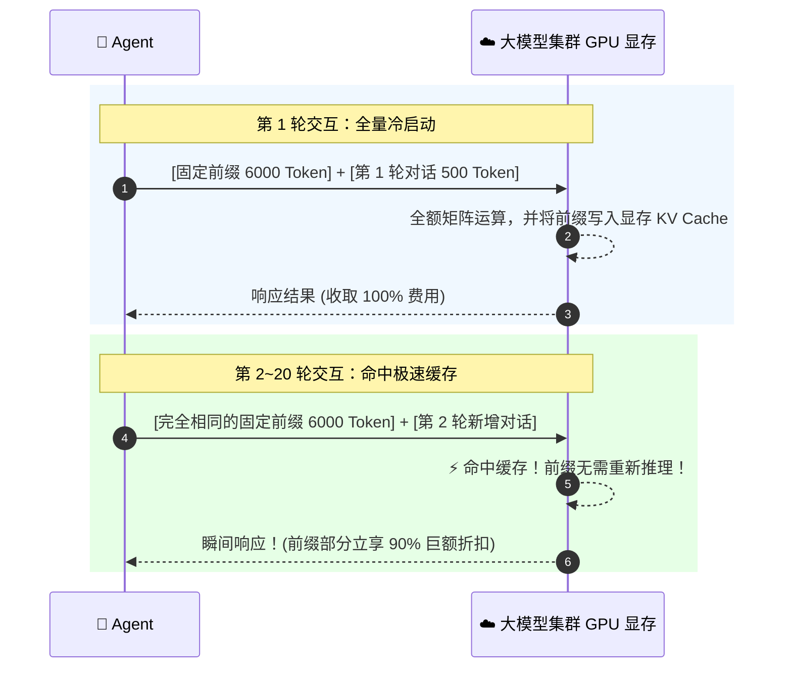

# 04. 怎样把信息喂给 Agent？——上下文工程、Prompt Caching 与 Token 剪枝

> **承接上篇**：  
> 在上一篇中，我们用会话树（Session Tree）解决了分支回退，用 RAG 解决了开卷检索。  
> 但很多新手往往会产生一个天真的想法：  
> **“现在的模型不是都已经支持 100 万甚至 200 万 Token 的超长上下文了吗？直接把整本书、几千行日志全部扔进 Prompt 里不就万事大吉了吗？”**  
> 为什么在 2023 年，斯坦福的一篇重磅论文瞬间击碎了这种盲目乐观？  
> 为什么把一个时间戳放错位置，就能让企业的 API 账单暴涨 10 倍？  
> 本篇我们将深入大模型的注意力神经深处，揭开 **上下文工程（Context Engineering）** 与工业级 Token 治理的终极秘密。

---

## 一、 溯源：从“窗口恐慌”到“迷失在中间”的历史反思

在大模型发展的早期，工程师每天都在为“Context Window（上下文窗口）太小”而焦虑发狂：
- GPT-3 的窗口只有可怜的 **2,048 个 Token**（约合 1,500 个汉字），多聊两句之前的对话就必须被生生截断；
- GPT-3.5 扩大到了 4K、16K；
- 到 2024 年，Claude 3.5 开放了 200K，Gemini 1.5 Pro 更是突破了 200 万 Token（相当于一次性吞下整部《红楼梦》加全套《哈利波特》）。

很多人欢呼雀跃：“上下文上限解决了，Agent 再也不需要精打细算了！”  
**然而，冷酷的现实很快给了所有人一记响亮的耳光。**

### 1. 划时代论文：斯坦福揭秘“迷失在中间 (Lost in the Middle)”
2023 年 7 月，斯坦福大学与加州大学伯克利分校联合发表了一篇震动学术界的论文：《Lost in the Middle: How Language Models Use Long Contexts》。  
研究人员做了一个极其残酷的实验：把关键答案放在一段超长文本的不同位置（开头、中间、结尾），测试大模型能否准确找到。

**实验结论令人震惊**：
- 当信息放在**最开头（Top）**或**最末尾（Bottom）**时，大模型表现极佳，准确率在 90% 以上；
- 一旦信息沉睡在**正中间（Middle）**，大模型的注意力会被周围的海量文字严重稀释，准确率断崖式暴跌至不足 30%！
- **本质根源**：Transformer 架构的自注意力机制在数学上存在距离衰减，大模型就像一个容易走神的人类，看书看到第 300 页时，早已神游天外。

---

## 二、 黄金架构：上下文的“三段式收纳法”

既然大模型存在致命的“U 型注意力缺陷”，我们喂给 Agent 的 Prompt 就绝对不能是一锅乱炖的烂账，而必须严格遵循**认知人体工学**进行排布：

---

## 三、 现代工业级黑科技：Prompt Caching (前缀缓存省钱术)

> 💡 **商业奇迹**：在 2024 年以前，跑一个复杂 Agent 任务可能要花 5 美元；今天跑同样的任务只要 0.3 美元，响应速度还快了 4 倍。  
> 背后最大的功臣不是模型降价，而是 **Prompt Caching（前缀 KV 缓存重用）**！

### 1. 传统无脑调用的“冤大头”悲剧
在 Agent Loop 循环中：
- 第 1 轮：发给大模型 8,000 字（包含 6,000 字的系统规则和工具说明 + 2,000 字的当前问题）；
- 第 2 轮：你又要把这 6,000 字系统规则一字不落地再发一遍给大模型；
- 第 10 轮：你还在重复发这 6,000 字！**每跑一轮，你都在为你 10 秒钟前刚刚发过的固定文字重复付全款！**

### 2. 破局之道：GPU 显存中的 KV Cache 复用
现在的顶级大模型厂商（Anthropic Claude 3.5、DeepSeek-V3 等）在服务端做了一项极其天才的优化：
- 如果检测到你发过来的请求，**最前面的几千个字符和上一轮完全一模一样**；
- 大模型集群的显卡直接在显存里读取之前已经计算好的数学矩阵（KV Cache），不再重新计算！
- **立竿见影的效果**：
  - **命中缓存的输入 Token 费用直接打一折（便宜 90%）！**
  - **首字返回延迟（TTFT）从 5 秒骤降至 0.8 秒！**

### ⚠️ 工业级避坑：一秒毁掉缓存的致命错误
很多新手在写代码时，喜欢在 System Prompt 最前面加上一句话：  
`"当前系统时间是: 2026-09-03 16:15:23"`。  
**这是极度灾难性的做法！**  
因为秒数每秒都在跳动，大模型服务器根据哈希校验前缀时，发现第一行就变了，导致**后方几千字的缓存全部失效，直接打回原形重新按原价扣费！**  
**铁律：永远保持最前面的系统设定与工具清单 100% 静态纯洁，动态的时间与最新变量只能拼在最后面！**

---

## 四、 巨量日志剪枝：三步给上下文瘦身

在编写 Coding Agent 时，执行一条 `npm test` 或编译命令，终端动辄喷出上万行冗长日志。如果直接塞回上下文，立刻就会引发上下文溢出与注意力走神。

### 剪枝三大实战板斧：
1. **掐头去尾法（Head-Tail Truncation）**：  
   保留前 30 行（看清楚运行了什么命令和启动环境）与最后 50 行（真正的报错堆栈 99% 都在末尾），中间内容一律折叠替换为：  
   `... ✂️ [监工自动剪枝: 省略中间 3,800 行正常输出日志] ...`；
2. **日志结果沙箱沉淀（Log Offloading）**：  
   当输出超过 20KB 时，系统将全量日志直接存为本地临时文件 `test_run.log`，只给大模型递一张便签纸：“日志已存为文件，如需深挖可调用 `read_file` 按行查看”；
3. **完成步骤微压缩（Micro-Compaction）**：  
   当一个大步骤已经完成（如依赖安装成功），系统自动把前几轮冗长的一问一答精简浓缩成一句话摘要：“【已完成】依赖安装完毕”，腾出宝贵的注意力和 Token 空间。

---

## 五、 承前启后：四大机制齐备，走进实战世界！

回顾走过的路，我们已经系统攻克了 Agent 的所有底层基石：
- 在 01 篇搞懂了 **ReAct 循环**；
- 在 02 篇搞懂了 **Tools 与 MCP 统一插座**；
- 在 03 篇搞懂了 **Session Tree 时光机与 RAG**；
- 在 04 篇搞懂了 **上下文黄金收纳与 Token 剪枝**。

有了这些深厚的底层功底，你已经彻底超越了市面上 90% 只会调调用包库的初学者。  
现在，让我们走向行业最炙手可热的两个顶级实战战场：  
1. **[01. 像程序员一样修 Bug 的 Coding Agent（自愈实战揭秘）](../03-advanced/01-coding-agent.md)**
2. **[02. 多 Agent 团队分工与协作架构](../03-advanced/02-multi-agent.md)**
