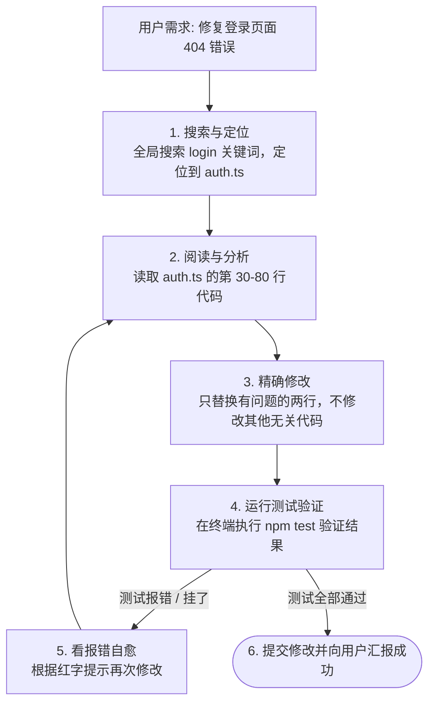

# 01. 像程序员一样修 Bug 的 Coding Agent

> **导读**：现在的 AI 已经不只是会写一两句代码了，像 Antigravity、Claude Code、Cursor 这类 Coding Agent 是怎么像真人工程师一样在整个项目里修 Bug 的？

---

## 🛠️ 1. Coding Agent 是怎么干活的？

---

## 🔍 2. 为什么它不会乱改你的整个文件？

很多新手担心：“让 AI 改代码，它会不会把我几千行的文件全删了只剩几行？”

**安全机制**：
成熟的 Coding Agent 使用的是 **“局部精准替换（Edit Block）”**，而不是把整个文件重写一遍。  
它会找到具体的定位锚点（比如第 45 行的前后代码），只精准替换那 3 行。

---

## 💡 3. 自愈（Self-Healing）的魅力

Coding Agent 强就强在它**拥有测试反馈闭环**：
- 它写完代码后不是直接交给你，而是自己悄悄运行一次测试用例；
- 发现测试没过，自己看终端报错信息；
- 自己换个修复方案再跑一次，直到测试全绿，才放心地向你汇报！
