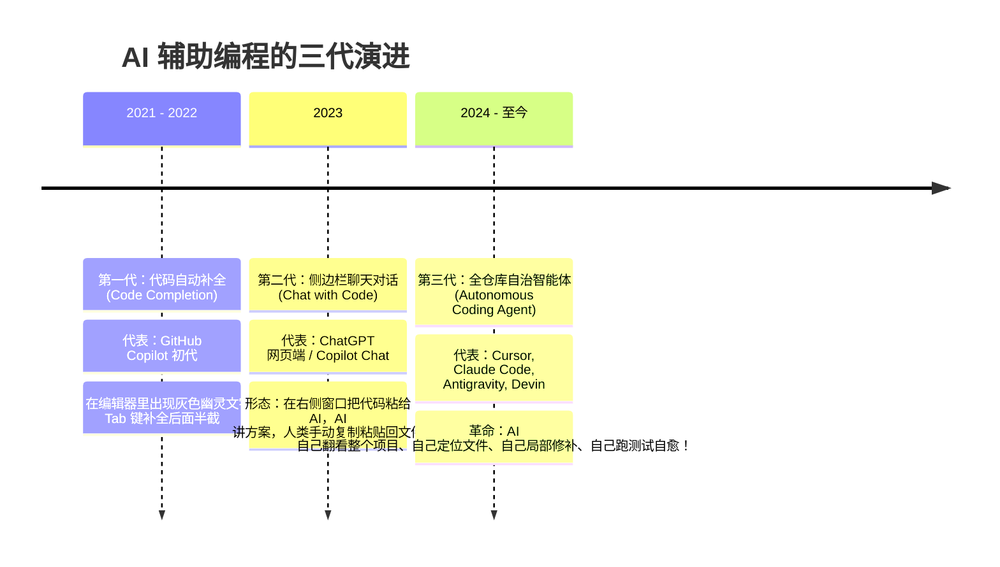

# 01. 像程序员一样修 Bug 的 Coding Agent 前世今生

> **承接上篇**：  
> 在前面的机制篇中，我们掌握了 ReAct 循环、工具调用、记忆树与上下文工程。  
> 但不知道你是否想过一个深刻的问题：  
> **为什么在法律、医疗、金融、文案等成百上千个行业中，唯独“编程（Coding Agent）”成为了全世界第一个真正跑通、产生数十亿美元商业价值的智能体赛道？**  
> 为什么像 Cursor、Claude Code、Antigravity、Devin 能够像老牌工程师一样，在几十万行的复杂项目里自主定位、修 Bug 甚至跑通测试？  
> 本篇我们将揭开 Coding Agent 能够“自愈自愈”背后的工程全貌。

---

## 一、 溯源：AI 辅助编程的三代跃迁史

从“猜你下一行写什么”到“把需求完整交付”，AI 编程经历了惊心动魄的三级跳：



### 为什么编程是 AI Agent 最理想的“天命土壤”？
与其他所有行业相比，代码世界拥有一个极其独一无二的数学特性：  
👉 **确定性的物理客观反馈（Deterministic Feedback Loop）！**
- 如果你让 AI 写一篇高考作文或商业策划书，写得好不好是主观的，大模型自己根本无法判断；
- **但代码完全不同**：代码写得对不对，只要丢进编译器执行一条 `npm test`，电脑终端在 1 秒内就会给出冷酷而精确的判定——要么通过（Exit Code 0），要么失败喷出红色报错堆栈（Exit Code 1）。
- **这个红绿反馈信号，就是 Agent 能够“自我反思、自我修复、直到全绿”的上帝之手！**

---

## 二、 工业级 Coding Agent 的标准作业流水线

一个成熟的 Coding Agent 是如何在庞大的工程代码库里穿梭自如的？请看这套经过全球顶级 IDE 验证的**标准排错闭环**：

```mermaid
flowchart TD
    User([🧑 用户指令: '修复用户登录时密码加密失败抛出的 500 错误']) --> Step1

    subgraph Phase1_搜寻与定位
        Step1["1. 全局侦测 (Repo Map & Grep)<br/>调用 grep_search 快速检索 'encryptPassword' 或 'login'<br/>锁定目标文件: src/auth/service.ts"]
    end

    subgraph Phase2_定向阅读
        Step1 --> Step2["2. 局部切片阅读 (Targeted Read)<br/>调用 read_file(start: 40, end: 90)<br/>坚决不读万行大文件，只看关键函数"]
    end

    subgraph Phase3_外科手术式修补
        Step2 --> Step3["3. 精准局部替换 (Atomic Edit)<br/>找到第 65 行: hashSync(pwd)<br/>替换为带有 salt 的: hashSync(pwd, salt)"]
    end

    subgraph Phase4_实弹验证与自愈
        Step3 --> Step4["4. 终端实弹运行 (Run Test)<br/>在终端执行 bash('npm test auth.spec.ts')"]
        
        Step4 -->|❌ 测试挂了 / 产生报错| Step5["5. 捕获 Stderr 反思自愈<br/>读到报错: 'salt is undefined'<br/>发现前面少了一行生成 salt 的逻辑"]
        Step5 -->|带着最新反思重新修补| Step3
        
        Step4 -->|✅ 测试全绿 (Exit Code 0)| Done(["🎉 6. 任务验收交付<br/>生成清晰的改动说明汇报给人类"])
    end
```

---

## 三、 Coding Agent 的三大看家本领深度解密

### 1. 代码库地图（Repo Map 与树图导航）
面对拥有数千个文件的企业级单体大仓，大模型不可能一次把所有代码看完。  
现代 Coding Agent 采用 **AST 语法树（如 tree-sitter）**：
- 先把所有文件的函数名、类名、类型定义提取出来，生成一张浓缩的项目骨架图（Repo Map）；
- Agent 看着这张骨架地图，就能瞬间推测出用户的问题大概位于哪个目录，再用 `grep_search` 像激光一样精确制导。

### 2. 外科手术式的局部修改（Atomic Edit）
在修改代码时，顶尖 Agent 严格遵守**“最小干预原则”**：
- 哪怕文件有 5,000 行，它也绝不重写文件；
- 它会通过严格的代码上下文锚点（Line Anchors），只对出问题的这 3 行代码发起原子替换；
- **好处**：零误删风险、零幻觉风险、极低 Token 消耗。

### 3. 闭环测试驱动自愈（Self-Healing Loop）
真正让工程师感到震撼的，是它的自愈能力：
- Agent 不依赖人类去告诉它“你代码写错了”；
- 它写完后自己悄悄跑单元测试；
- 第一次测试可能因为少引入了一个 import 挂掉，它读取到报错后自己补上 import；
- 第二次测试可能因为类型声明挂掉，它读取到报错后自己加上类型断言；
- 经过 2~3 轮静默自运转，最终展现在人类眼前的，是一份已经全部通过测试的完美代码！

---

## 四、 承前启后：单兵作战很强，大工程怎么打群架？

通过本篇，你已经看清了现代 Coding Agent 能够自主修代码的底层逻辑。这也是为什么在我们的代码实战中，专门安排了 **Demo 5（自愈排错 Mini Pi Agent）** 让大家亲手跑通这一全过程！  
但是，如果我们要开发一个大型电商系统：
- 需要有人写产品需求说明；
- 需要有人设计前端界面；
- 需要有人写后端接口；
- 需要有人做代码安全审计。  
一个 Agent 既当爹又当妈，很容易注意力过载。  
**怎样让多个专门领域的 Agent 像软件外包公司一样组团打群架？**  
请看下一篇——  
👉 **[02. 多 Agent 团队分工与协作架构 (Multi-Agent)](02-multi-agent.md)**
