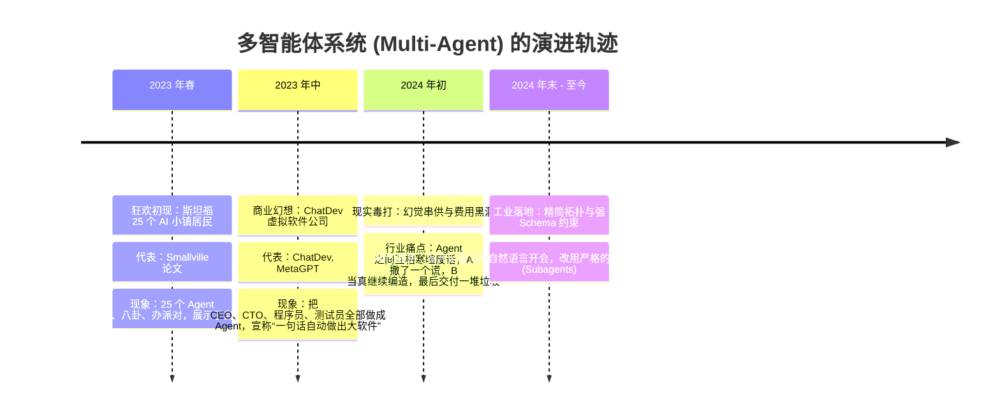
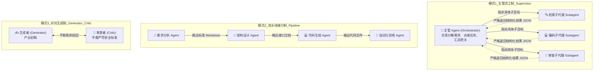

# 02. 多 Agent 团队分工与协作架构的前世今生

> **承接上篇**：  
> 在上一篇中，我们见证了单个 Coding Agent 在代码沙箱里的强大自愈能力。  
> 但人类社会的伟大工程，从来不是靠独行侠单打独斗完成的。  
> 2023 年，斯坦福的“AI 小镇 (Smallville)”和清华开源的“ChatDev 虚拟软件公司”火爆全网，让人们看到了多个 Agent 协作的震撼未来。  
> 但到了 2024 年，许多企业盲目堆砌数十个 Agent，却遭遇了惨烈的“成本爆炸”与“集体幻觉串供”。  
> 多智能体（Multi-Agent）的底层协作拓扑到底是怎样的？如何在实战中避开过度设计的智商税？  
> 本篇我们将深入多 Agent 协同的核心机理与工业级设计准则。

---

## 一、 溯源：从“虚拟小镇狂欢”到“工业级清醒”

多智能体系统（Multi-Agent Systems, MAS）的发展经历了一场从过度狂热到务实理性的洗礼：

### 1. 2023 年的狂喜：AI 群体的“自发涌现”
2023 年 4 月，斯坦福大学发表论文《Generative Agents: Interactive Simulacra of Human Behavior》，创造了一个名为 Smallville 的虚拟像素小镇。25 个拥有独立记忆的大模型智能体在小镇里生活，它们不仅能记住昨天谁借了钱，还能自发筹备一场情人节派对。这一实验彻底点燃了学术界对多智能体协作的想象力。

紧接着，清华大学团队开源了 **ChatDev**，把一个软件外包公司的所有岗位（CEO、CPO、CTO、Coder、Tester）全部用 Prompt 扮演，让它们在群里像人类一样开会交流，几分钟生成一个小游戏。

### 2. 2024 年的阵痛：三大“多 Agent 翻车惨案”
当企业真正尝试用这套逻辑做严肃业务时，很快被现实上了一课：
1. **传话筒式集体幻觉（Hallucination Cascades）**：  
   产品经理 Agent 凭空脑补了一个不存在的业务逻辑；研发 Agent 把这个假逻辑当成圣经写了 1,000 行代码；测试 Agent 拿着假逻辑去测，竟然宣称“测试全部通过”！整条链路都在“合理合规地造假”。
2. **客套废话的费用黑洞（Chatter Overhead）**：  
   如果让 Agent 之间用自由自然语言聊天，它们会极其礼貌：“收到，感谢您的反馈，我这就为您修改……”、“非常赞同您的意见，请过目……”。**80% 的 Token 费用全浪费在彼此毫无价值的职场寒暄上！**
3. **极度迟钝的响应延迟（Latency Explosion）**：  
   用户问一个问题，要在屏幕前苦苦等待 3~5 分钟看群里的 Agent 轮流发言，体验极差。

---

## 二、 工业级三大多 Agent 协作拓扑架构

痛定思痛后，工业界彻底抛弃了“在群里无约束自由闲聊”的玩具形态，沉淀出了 **三大成熟、受控的确定性协作拓扑**：

### 1. 模式 1：主管-员工制 (Supervisor / Subagent 架构)
- **核心逻辑**：有一个掌控全局的总脑（Orchestrator）。面对用户的复杂需求，它不会亲自去翻看成千上万行细节，而是**动态唤醒专职子代理（Subagent）**。
- **真实工业映射**：你在使用 Antigravity IDE 或顶级开发工具时，底层就是这一机制。主 Agent 遇到“查看官方最新文档”时，悄悄派生出一个 `librarian` 子代理去调研，调研完毕只返回 3 行核心结论给主 Agent，**子代理查阅几万字文档的肮脏上下文随用随销毁，绝不污染主 Agent 的视野！**

### 2. 模式 2：流水线接力制 (Sequential Pipeline)
- **核心逻辑**：像汽车装配流水线一样，每个 Agent 是流水线上的一个专业工位。上一工位输出严格的标准化产物，作为下一工位的输入。
- **适用场景**：标准化技术博客撰写、自动化安全合规扫描。

### 3. 模式 3：对抗辩论制 (Generator-Critic)
- **核心逻辑**：一个负责干活，另一个手握极其变态的 checklist 专门挑刺。
- **适用场景**：金融风控审计、智能合约安全检测。

---

## 三、 避坑准则：什么时候该用 Multi-Agent？

请将以下黄金法则牢记在心：

> 💡 **工业级设计第一定律**：  
> **能用单个 Agent 解决的问题，坚决不用 Multi-Agent！**  
> **只有当上下文过载（Context Contamination）或安全权限必须物理隔离时，才引入 Multi-Agent！**

| 决策场景 | 推荐方案 | 核心理由 |
| :--- | :--- | :--- |
| **修一个简单的 Bug / 查一段 API 用法** | **单 Agent** | 单个上下文完全能装下，单兵反应最快、费用最低。 |
| **既要在公网搜几万字资料，又要在内网改核心代码** | **Supervisor + Subagent** | 必须用子代理做“上下文隔离”，防止几万字网页废话挤占核心代码的注意力。 |
| **高风险转账 / 生产数据库变更操作** | **Generator + Critic (加人工审核)** | 单 Agent 容易产生自信幻觉，必须有专职安全审查 Agent 做双重签名。 |

---

## 四、 理论篇全貌收官与实战呼唤！

恭喜你！到这里，你已经完整遍历了现代 AI Agent 的全部理论拼图：
1. **认知启蒙**：从符号主义到 AutoGPT 的前世今生；
2. **解剖四大件**：大脑（LLM）、手脚（Tools）、记事本（Memory）、监工安全绳（Harness）；
3. **核心机制**：ReAct 循环、MCP 统一插口、Session Tree 时光机、Prompt Caching 与上下文剪枝；
4. **进阶实战**：Coding Agent 自愈排错、Multi-Agent 协作拓扑。

理论已经足够扎实，现在是时候**亲手敲下代码，让你的第一只智能体在终端里呼吸跳动了**！  
请立即前往实战代码库，开始你的通关之旅：  
👉 **[项目实战入口：Mini Pi Agent (TypeScript 实战)](../../projects/mini-pi-agent/README.md)**
- `npm run demo1`：最简 ReAct 循环
- `npm run demo2`：四大真实核心工具
- `npm run demo3`：会话树时光机
- `npm run demo4`：上下文日志剪枝
- 🌟 **`npm run demo5`**：完整自愈排错 Mini Pi Agent CLI！
