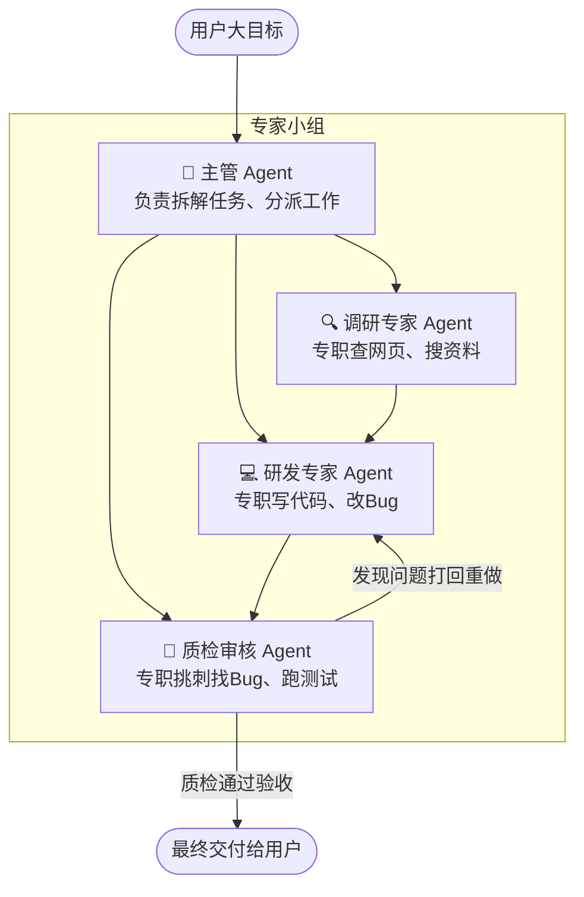

# 02. 多 Agent 团队分工协作 (Multi-Agent)

> **导读**：一个好汉三个帮。当一个任务特别庞大时，怎样让几个 Agent 组成一个小团队互相配合？

---

## 👥 1. 为什么要组建 Agent 团队？

如果让一个 Agent 既要写代码、又要写文案、还要做审核、还要负责测试，它很容易脑子转不过来（发生目标漂移或遗漏）。

**团队分工模式**：

---

## 🤝 2. 常见的 3 种团队协作形态

1. **主管-员工模式（Supervisor）**：一个总控主管负责发号施令，其他人做完向主管汇报；
2. **流水线接力模式（Pipeline）**：A 干完传给 B，B 干完传给 C，像工厂流水线一样层层加工；
3. **红蓝对抗与辩论模式（Debate）**：一个 Agent 负责写，另一个专门负责挑刺审查，反复磨合出最高质量的成果。
