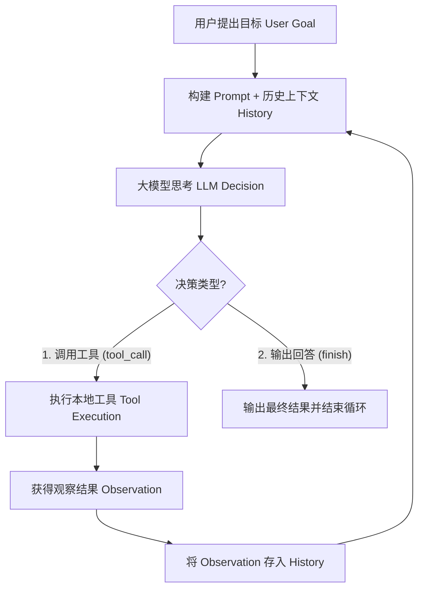

# 01 - Agent Loop（自治循环原理深度拆解）

## 一、 什么是 Agent Loop？

在传统编程中，程序的执行逻辑由程序员提前写死（例如 `if-else` 或 `for` 循环）。
而在 AI Agent 中，程序的控制流被移交给了大模型（LLM），形成了一个**基于动态决策的闭环循环**，被称为 **ReAct (Reasoning + Acting) 循环**。

---

## 二、 核心四大步骤拆解

### 1. 记忆构建（Context & History Assembly）
每次循环开始时，框架都会打包一个消息数组发送给 LLM：
* **System Prompt**：Agent 身份、规则定义、当前使用的工具 Schema。
* **User Goal**：用户最初提出的原始任务需求。
* **Tool Observations**：此前每一轮工具调用的执行结果（文件内容、终端输出、报错日志等）。

### 2. LLM 推理决策（Reasoning）
大模型读取全量历史，做出二选一的决定：
* **分支 A**：需要补充信息或修改代码 ➡️ 输出 `tool_call`（包含工具名与参数 JSON）。
* **分支 B**：任务已全部完成 ➡️ 输出普通文本答案，并标记完成。

### 3. 工具执行与观察（Acting & Observation）
框架拦截大模型返回的 `tool_call`，在本地运行对应函数（如读取硬盘文件、运行终端 `npm test`），并将执行结果封装为 `Observation`。

### 4. 反馈入栈（Feedback Loop）
将 `Observation` 作为 `role: "tool"` 追加到历史记忆末尾，进入下一轮 `while` 循环。

---

## 三、 关键工程细节与注意点

1. **为什么 Agent Loop 最少跑 2 轮？**
   * 涉及到干活（调工具）的任务，至少需要 2 轮：
     * **第 1 轮**：用户提问 ➡️ 模型思考并决定调用工具 ➡️ 框架执行工具获取结果。
     * **第 2 轮**：模型带着工具结果重新思考 ➡️ 验证确认完成 ➡️ 输出答案并退出循环。

2. **防止死循环机制（Infinite Loop Safety）**
   * 如果 Agent 遇到的 Bug 无法解决，可能会陷入无限重试。
   * **解决方案**：设置硬性上限（如 `max_steps = 20`）或 Token 消耗阈值，一旦超出强制退出并请人类干预。
