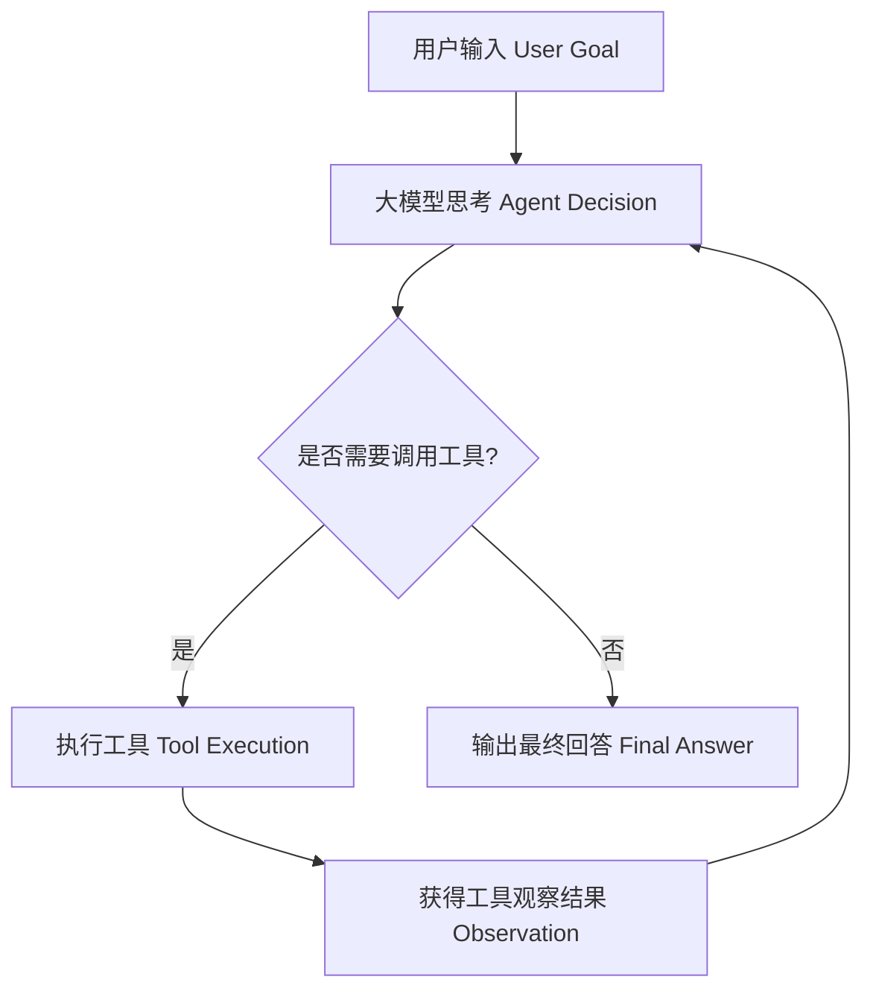

# 01 - Agent Loop（自治循环原理）

## 什么是 Agent Loop？

在传统编程中，程序的执行路径是固定的（`A -> B -> C`）。
而在 AI Agent 中，程序的执行逻辑变成了一个**基于大模型决策的动态循环**（Thought -> Action -> Observation Loop）。

## 核心流程

1. **Prompt 组装**：将系统提示词（System Prompt）、历史对话上下文、可用工具定义（Tools Definition）以及当前用户目标传入 LLM。
2. **LLM 决策**：模型选择输出纯文本（结束循环），或者输出格式化的工具调用指令（如 `read`, `write`, `edit`, `bash`）。
3. **工具执行**：Agent 框架捕获工具指令，运行对应函数，取得返回值（如代码运行日志或文件内容）。
4. **反馈入栈**：将工具执行结果作为 `tool` 角色消息追加到上下文中，进入下一轮循环。

## Pi Agent 的设计特点

* **极简循环**：无复杂的级联 Agent 或图流框架，代码清晰易懂。
* **终止条件**：明确的 Stop 状态判定，避免死循环。
